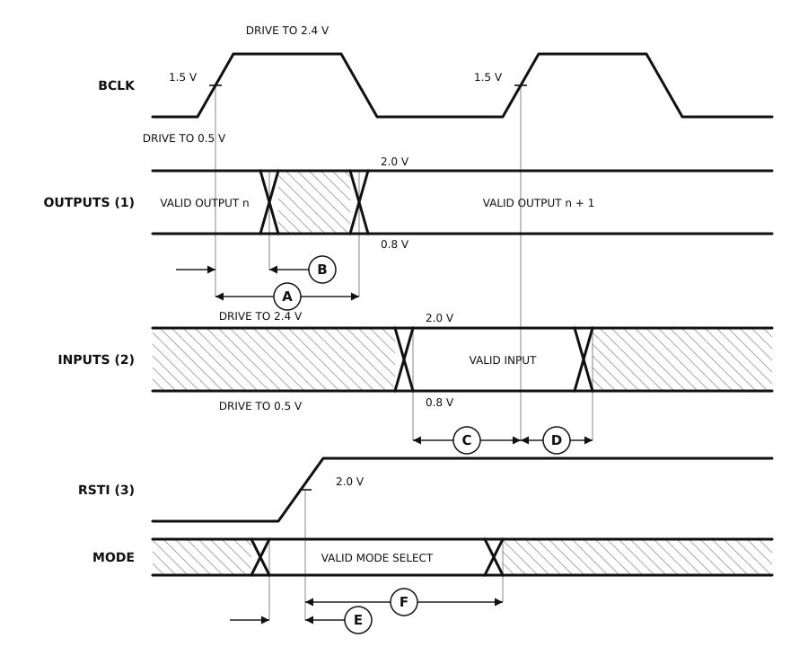

# Figure 10-2. Drive Levels and Test Points for AC Specifications

Redrawn from **Figure 10-2** of the M68000 8-/16-/32-Bit Microprocessors
User's Manual (PDF page 157, printed page 10-6 — see
[`13-section-10-electrical-and-thermal-characteristics.pdf`](13-section-10-electrical-and-thermal-characteristics.pdf) page 6 for the original scan).

Not a bus cycle but the convention the rest of the section is written in: where an output delay is measured from, where an input setup time is measured to, and what voltage the tester drives and senses at.

| | Legend | |
|:-:|---|---|
| Ⓐ | Maximum output delay specification | clock 1.5 V to the new output valid |
| Ⓑ | Minimum output hold time | clock 1.5 V to the old output going invalid |
| Ⓒ | Minimum input setup time specification | input valid to clock 1.5 V |
| Ⓓ | Minimum input hold time specification | clock 1.5 V to input invalid |
| Ⓔ | Mode select setup time to RESET negated | |
| Ⓕ | Mode select hold time from RESET negated | |

The source's notes: output timing (1) applies to every parameter specified
relative to the rising edge of the clock, input timing (2) likewise, and the
reset timing (3) to every parameter specified relative to the negation of
`RESET`.

**Two of the signal names in this figure do not belong to this processor.**
The clock is labelled `BCLK` and the reset input `RSTI`, which are MC68040-era
names; everywhere else in the manual they are `CLK` and `RESET`. The figure
was evidently lifted from another book. The bottom row, the mode-select input,
carries no label at all in the source — it is identified here from legend
items E and F.

## About this redrawing

The waveform is drawn with deliberately exaggerated ramps so that the edge measurements are visible; ramp width, plateau width and the ratio between them carry no information, and nor do they in the original.

**Callout anchors follow what each specification measures**, per its
description in [`ac-electrical-specifications.csv`](ac-electrical-specifications.csv),
rather than the pixel position of the arrowhead on the scan. Where the two
disagree the CSV wins, because the CSV is where the numbers live.

Rendered as a plain SVG referenced as an image, which is the only diagram
format that survives GitHub's markdown pipeline — GitHub supports no waveform
syntax (Mermaid has none) and strips inline `<svg>`. The figure adapts to
light and dark themes.

## Regenerating

`figure-10-02-drive-levels-and-test-points.svg` is hand-authored rather than generated: it is an
annotation figure, not a bus cycle, and the shared drawing engine
(`timingsvg.py`) has no vocabulary for threshold crossings and drive levels.
Edit the SVG directly. Nothing on this page is generated from the CSVs — the
figure marks no numbered specification.
