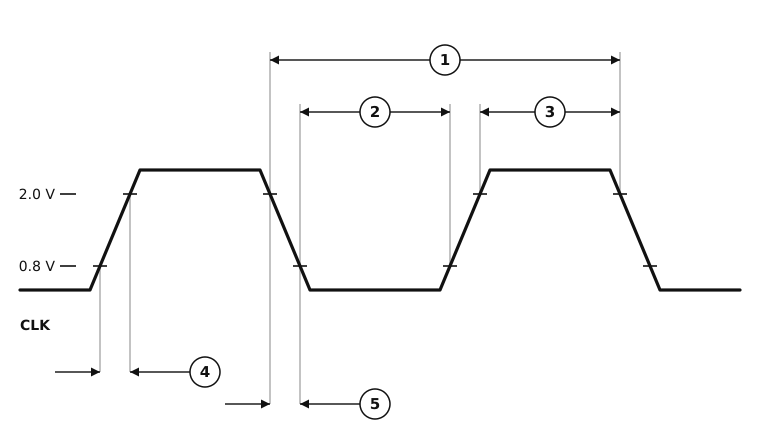

# Figure 10-3. Clock Input Timing Diagram

Redrawn from **Figure 10-3** of the M68000 8-/16-/32-Bit Microprocessors
User's Manual (PDF page 160, printed page 10-9 — see
[`13-section-10-electrical-and-thermal-characteristics.pdf`](13-section-10-electrical-and-thermal-characteristics.pdf) page 9 for the original scan).

The clock input, with the two thresholds every other figure in the section is referenced to. Specifications 2 and 3 share one table row, as do 4 and 5.



## Specifications marked on this figure

<!-- BEGIN TABLE from=ac-electrical-specifications.csv table=clock grades=m68000 nums=|1|2,_3|4,_5 -->
| Num. | Characteristic | Unit | 8 MHz | 10 MHz | 12.5 MHz | 16.67 MHz 12F | 16 MHz | 20 MHz |
|:-:|---|:-:|--:|--:|--:|--:|--:|--:|
| — | Frequency of Operation | MHz | 4.0&nbsp;–&nbsp;8.0 | 4.0&nbsp;–&nbsp;10.0 | 4.0&nbsp;–&nbsp;12.5 | 8.0&nbsp;–&nbsp;16.7 | 8.0&nbsp;–&nbsp;16.7 | 8.0&nbsp;–&nbsp;20.0 |
| 1 | Cycle Time | ns | 125&nbsp;–&nbsp;250 | 100&nbsp;–&nbsp;250 | 80&nbsp;–&nbsp;250 | 60&nbsp;–&nbsp;125 | 60&nbsp;–&nbsp;125 | 50&nbsp;–&nbsp;125 |
| 2, 3 | Clock Pulse Width (Measured from 1.5 V to 1.5 V for 12F) | ns | 55&nbsp;–&nbsp;125 | 45&nbsp;–&nbsp;125 | 35&nbsp;–&nbsp;125 | 27&nbsp;–&nbsp;62.5 | 27&nbsp;–&nbsp;62.5 | 21&nbsp;–&nbsp;62.5 |
| 4, 5 | Clock Rise and Fall Times | ns | ≤ 10 | ≤ 10 | ≤ 5 | ≤ 5 | ≤ 5 | ≤ 4 |
<!-- END TABLE -->

A range `a – b` is min–max; `≤ b` is a maximum with no minimum specified; `≥ a`
is a minimum with no maximum; `—` is not specified at that grade. The
superscript on a specification number is its footnote in the source table.
Full descriptions, footnotes, test conditions and the source page of every row
are in [`ac-electrical-specifications.csv`](ac-electrical-specifications.csv).

| | Measurement | Taken between |
|:-:|---|---|
| ① | Cycle time | the 2.0 V point of one falling edge and the 2.0 V point of the next |
| ② | Clock pulse width, low | the 0.8 V point of a falling edge and the 0.8 V point of the following rising edge |
| ③ | Clock pulse width, high | the 2.0 V point of a rising edge and the 2.0 V point of the following falling edge |
| ④ | Rise time | the 0.8 V and 2.0 V points of a rising edge |
| ⑤ | Fall time | the 2.0 V and 0.8 V points of a falling edge |

④ is the **rise** time and ⑤ the **fall** time, which is the same way round as
the MC68030 data sheet and the reverse of the MC68881/MC68882 manual. The
table gives one entry, "4, 5 Clock Rise and Fall Times", so the two share a
limit and nothing numerical turns on it.

The MC68008 has its own clock table with its own, slower limits:

<!-- BEGIN TABLE from=ac-electrical-specifications.csv table=clock-mc68008 grades=mc68008 -->
| Num. | Characteristic | Unit | 8 MHz | 10 MHz |
|:-:|---|:-:|--:|--:|
| — | Frequency of Operation | MHz | 2.0&nbsp;–&nbsp;8.0 | 2.0&nbsp;–&nbsp;10.0 |
| 1 | Cycle Time | ns | 125&nbsp;–&nbsp;500 | 100&nbsp;–&nbsp;500 |
| 2, 3 | Clock Pulse Width | ns | 55&nbsp;–&nbsp;250 | 45&nbsp;–&nbsp;250 |
| 4, 5 | Clock Rise and Fall Times | ns | ≤ 10 | ≤ 10 |
<!-- END TABLE -->

Sanity check on the numbers. A whole period must hold one high pulse and one
low pulse, so *minimum* pulse width + *maximum* pulse width can never exceed
the *maximum* cycle time. Every grade passes: 55 + 125 = 180 ≤ 250,
45 + 125 = 170 ≤ 250, 35 + 125 = 160 ≤ 250, 27 + 62.5 = 89.5 ≤ 125,
21 + 62.5 = 83.5 ≤ 125. Unlike the MC68881/MC68882 manual, this one has no
impossible corner in its clock table.

## About this redrawing

The waveform is drawn with deliberately exaggerated ramps so that the edge measurements are visible; ramp width, plateau width and the ratio between them carry no information, and nor do they in the original.

**Callout anchors follow what each specification measures**, per its
description in [`ac-electrical-specifications.csv`](ac-electrical-specifications.csv),
rather than the pixel position of the arrowhead on the scan. Where the two
disagree the CSV wins, because the CSV is where the numbers live.

Rendered as a plain SVG referenced as an image, which is the only diagram
format that survives GitHub's markdown pipeline — GitHub supports no waveform
syntax (Mermaid has none) and strips inline `<svg>`. The figure adapts to
light and dark themes.

## Regenerating

`figure-10-03-clock-input-timing.svg` is hand-authored rather than generated: it is an
annotation figure, not a bus cycle, and the shared drawing engine
(`timingsvg.py`) has no vocabulary for threshold crossings and drive levels.
Edit the SVG directly. The tables above are generated:

```sh
python3 make-figure-tables.py
```
