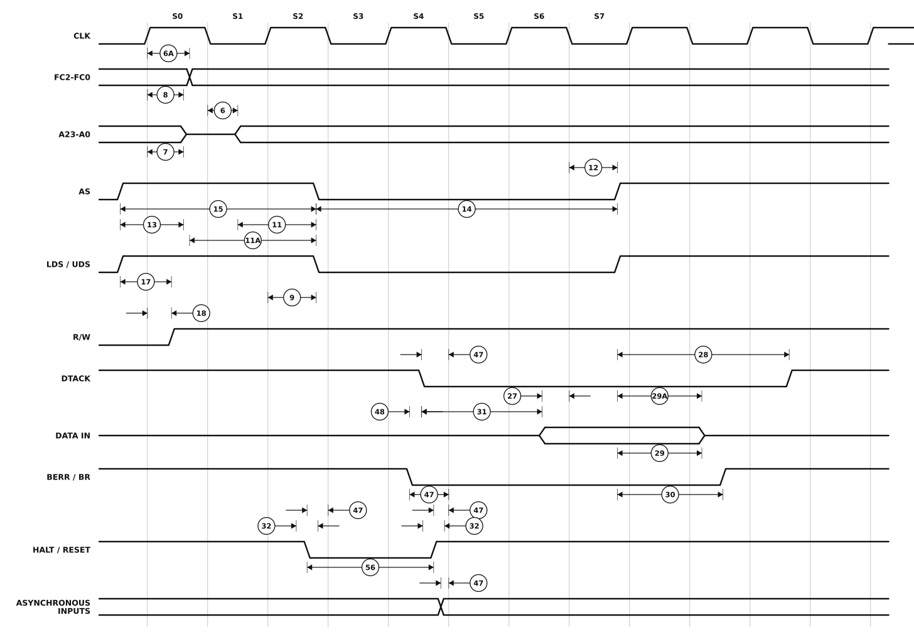

# Figure 10-4. Read Cycle Timing Diagram

Redrawn from **Figure 10-4** of the M68000 8-/16-/32-Bit Microprocessors
User's Manual (PDF page 164, printed page 10-13 — see
[`13-section-10-electrical-and-thermal-characteristics.pdf`](13-section-10-electrical-and-thermal-characteristics.pdf) page 13 for the original scan).

A complete asynchronous read. The function code and address go out during S0 and S1, `AS` and the data strobes assert in S2, the slave answers with `DTACK`, the data is latched on the falling edge of S6 and the strobes negate in S7. The three rows at the bottom show what else the processor is sampling while that happens.



## Specifications marked on this figure

<!-- BEGIN TABLE from=ac-electrical-specifications.csv table=read-write grades=m68000 nums=6|6A|7|8|9|11|11A|12|13|14|15|17|18|27|28|29|29A|30|31|32|47|48|56 -->
| Num. | Characteristic | Unit | 8 MHz | 10 MHz | 12.5 MHz | 16.67 MHz 12F | 16 MHz | 20 MHz |
|:-:|---|:-:|--:|--:|--:|--:|--:|--:|
| 6 | Clock Low to Address Valid | ns | ≤ 62 | ≤ 50 | ≤ 50 | ≤ 50 | ≤ 30 | ≤ 25 |
| 6A | Clock High to FC Valid | ns | ≤ 62 | ≤ 50 | ≤ 45 | ≤ 45 | 0&nbsp;–&nbsp;30 | 0&nbsp;–&nbsp;25 |
| 7 | Clock High to Address, Data Bus High Impedance (Maximum) | ns | ≤ 80 | ≤ 70 | ≤ 60 | ≤ 50 | ≤ 50 | ≤ 42 |
| 8 | Clock High to Address, FC Invalid (Minimum) | ns | ≥ 0 | ≥ 0 | ≥ 0 | ≥ 0 | ≥ 0 | ≥ 0 |
| 9<sup>1</sup> | Clock High to AS, DS Asserted | ns | 3&nbsp;–&nbsp;60 | 3&nbsp;–&nbsp;50 | 3&nbsp;–&nbsp;40 | 3&nbsp;–&nbsp;40 | 3&nbsp;–&nbsp;30 | 3&nbsp;–&nbsp;25 |
| 11<sup>2</sup> | Address Valid to AS, DS Asserted (Read)/AS Asserted (Write) | ns | ≥ 30 | ≥ 20 | ≥ 15 | ≥ 15 | ≥ 15 | ≥ 10 |
| 11A<sup>2</sup> | FC Valid to AS, DS Asserted (Read)/AS Asserted (Write) | ns | ≥ 90 | ≥ 70 | ≥ 60 | ≥ 30 | ≥ 45 | ≥ 40 |
| 12<sup>1</sup> | Clock Low to AS, DS Negated | ns | ≤ 62 | ≤ 50 | ≤ 40 | ≤ 40 | 3&nbsp;–&nbsp;30 | 3&nbsp;–&nbsp;25 |
| 13<sup>2</sup> | AS, DS Negated to Address, FC Invalid | ns | ≥ 40 | ≥ 30 | ≥ 20 | ≥ 10 | ≥ 15 | ≥ 10 |
| 14<sup>2</sup> | AS (and DS Read) Width Asserted | ns | ≥ 270 | ≥ 195 | ≥ 160 | ≥ 120 | ≥ 120 | ≥ 100 |
| 15<sup>2</sup> | AS, DS Width Negated | ns | ≥ 150 | ≥ 105 | ≥ 65 | ≥ 60 | ≥ 60 | ≥ 50 |
| 17<sup>2</sup> | AS, DS Negated to R/W Invalid | ns | ≥ 40 | ≥ 30 | ≥ 20 | ≥ 10 | ≥ 15 | ≥ 10 |
| 18<sup>1</sup> | Clock High to R/W High (Read) | ns | 0&nbsp;–&nbsp;55 | 0&nbsp;–&nbsp;45 | 0&nbsp;–&nbsp;40 | 0&nbsp;–&nbsp;40 | 0&nbsp;–&nbsp;30 | 0&nbsp;–&nbsp;25 |
| 27<sup>5</sup> | Data-In Valid to Clock Low (Setup Time on Read) | ns | ≥ 10 | ≥ 10 | ≥ 10 | ≥ 7 | ≥ 5 | ≥ 5 |
| 28<sup>2,11</sup> | AS, DS Negated to DTACK Negated (Asynchronous Hold) | ns | 0&nbsp;–&nbsp;240 | 0&nbsp;–&nbsp;190 | 0&nbsp;–&nbsp;150 | 0&nbsp;–&nbsp;110 | 0&nbsp;–&nbsp;110 | 0&nbsp;–&nbsp;95 |
| 29 | AS, DS Negated to Data-In Invalid (Hold Time on Read) | ns | ≥ 0 | ≥ 0 | ≥ 0 | ≥ 0 | ≥ 0 | ≥ 0 |
| 29A | AS, DS Negated to Data-In High Impedance | ns | ≤ 187 | ≤ 150 | ≤ 120 | ≤ 90 | ≤ 90 | ≤ 75 |
| 30 | AS, DS Negated to BERR Negated | ns | ≥ 0 | ≥ 0 | ≥ 0 | ≥ 0 | ≥ 0 | ≥ 0 |
| 31<sup>2,5</sup> | DTACK Asserted to Data-In Valid (Setup Time) | ns | ≤ 90 | ≤ 65 | ≤ 50 | ≤ 40 | ≤ 50 | ≤ 42 |
| 32 | HALT and RESET Input Transition Time | ns | 0&nbsp;–&nbsp;200 | 0&nbsp;–&nbsp;200 | 0&nbsp;–&nbsp;200 | 0&nbsp;–&nbsp;150 | ≤ 150 | 0&nbsp;–&nbsp;150 |
| 47<sup>5</sup> | Asynchronous Input Setup Time | ns | ≥ 10 | ≥ 10 | ≥ 10 | ≥ 10 | ≥ 5 | ≥ 5 |
| 48<sup>2,3</sup> | BERR Asserted to DTACK Asserted | ns | ≥ 20 | ≥ 20 | ≥ 20 | ≥ 10 | ≥ 10 | ≥ 10 |
| 56<sup>4</sup> | HALT/RESET Pulse Width | clks | ≥ 10 | ≥ 10 | ≥ 10 | ≥ 10 | ≥ 10 | ≥ 10 |
<!-- END TABLE -->

A range `a – b` is min–max; `≤ b` is a maximum with no minimum specified; `≥ a`
is a minimum with no maximum; `—` is not specified at that grade. The
superscript on a specification number is its footnote in the source table.
Full descriptions, footnotes, test conditions and the source page of every row
are in [`ac-electrical-specifications.csv`](ac-electrical-specifications.csv).

Specification 48 is drawn between `BERR` asserting and `DTACK` asserting; if
specification 47 is met for both of them, note 3 of the table says 48 may be
ignored.

Specification 32 is the input transition time — the ramp on `HALT`/`RESET`
itself. The engine draws every edge with the same short ramp, so there is no
drawn ramp to measure, so the two 32 callouts are given a visible width
centred on the transition instead.

## About this redrawing

The horizontal axis is the source's own bus-state ruler, recovered by measurement: on page 10-13 the printed S0-S7 labels sit 89 px apart at 300 dpi and each is centred on a clock plateau, so the state boundaries fall halfway between labels. Every edge below is drawn at the time the source draws it, delays included.

**Callout anchors follow what each specification measures**, per its
description in [`ac-electrical-specifications.csv`](ac-electrical-specifications.csv),
rather than the pixel position of the arrowhead on the scan. Where the two
disagree the CSV wins, because the CSV is where the numbers live.

Overbars are lost in the redrawing: `AS`, `DS`, `UDS`, `LDS`, `DTACK`, `BERR`,
`BR`, `BG`, `BGACK`, `HALT`, `RESET`, `VMA` and `VPA` are all active low.
A signal drawn on a mid-rail line is not being driven at all.

Rendered as a plain SVG referenced as an image, which is the only diagram
format that survives GitHub's markdown pipeline — GitHub supports no waveform
syntax (Mermaid has none) and strips inline `<svg>`. The figure adapts to
light and dark themes.

## Regenerating

```sh
python3 make-figure-svg.py 4      # redraw this figure
python3 make-figure-tables.py         # refresh the table above from the CSV
```
