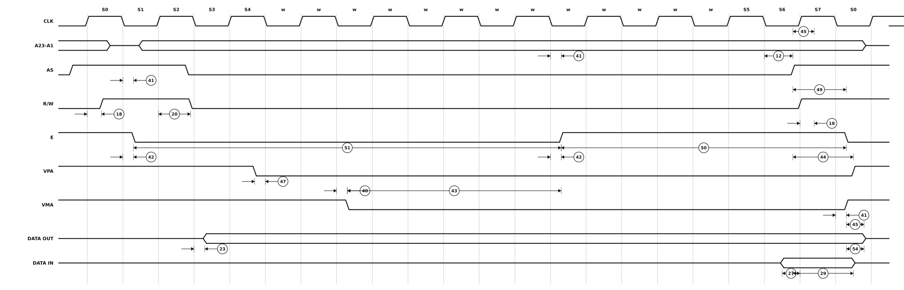

# Figure 10-6. MC68000 to M6800 Peripheral Timing Diagram (Best Case)

Redrawn from **Figure 10-6** of the M68000 8-/16-/32-Bit Microprocessors
User's Manual (PDF page 167, printed page 10-16 — see
[`13-section-10-electrical-and-thermal-characteristics.pdf`](13-section-10-electrical-and-thermal-characteristics.pdf) page 16 for the original scan).

An M6800 peripheral cycle. `E` is the M6800 enable clock — six clock periods low, four high, free-running and unrelated to the bus cycle — so the processor inserts wait states after S4 until `VPA` can be recognised in phase with it. The source draws thirteen; the cycle length depends entirely on where `VPA` lands relative to `E`.



## Specifications marked on this figure

<!-- BEGIN TABLE from=ac-electrical-specifications.csv table=m6800-peripheral grades=m68000 nums=12|18|20|23|27|29|40|41|42|43|44|45|47|49|50|51|54 -->
| Num. | Characteristic | Unit | 8 MHz<sup>&ast;</sup> | 10 MHz<sup>&ast;</sup> | 12.5 MHz<sup>&ast;</sup> | 16.67 MHz 12F | 16 MHz | 20 MHz<sup>&ast;&ast;</sup> |
|:-:|---|:-:|--:|--:|--:|--:|--:|--:|
| 12<sup>1</sup> | Clock Low to AS, DS Negated | ns | ≤ 62 | ≤ 50 | ≤ 40 | ≤ 40 | 3&nbsp;–&nbsp;30 | 3&nbsp;–&nbsp;25 |
| 18<sup>1</sup> | Clock High to R/W High (Read) | ns | 0&nbsp;–&nbsp;55 | 0&nbsp;–&nbsp;45 | 0&nbsp;–&nbsp;40 | 0&nbsp;–&nbsp;40 | 0&nbsp;–&nbsp;30 | 0&nbsp;–&nbsp;25 |
| 20<sup>1</sup> | Clock High to R/W Low (Write) | ns | 0&nbsp;–&nbsp;55 | 0&nbsp;–&nbsp;45 | 0&nbsp;–&nbsp;40 | 0&nbsp;–&nbsp;40 | 0&nbsp;–&nbsp;30 | 0&nbsp;–&nbsp;25 |
| 23 | Clock Low to Data-Out Valid (Write) | ns | ≤ 62 | ≤ 50 | ≤ 50 | ≤ 50 | ≤ 30 | ≤ 25 |
| 27 | Data-In Valid to Clock Low (Setup Time on Read) | ns | ≥ 10 | ≥ 10 | ≥ 10 | ≥ 7 | ≥ 5 | ≥ 5 |
| 29 | AS, DS Negated to Data-In Invalid (Hold Time on Read) | ns | ≥ 0 | ≥ 0 | ≥ 0 | ≥ 0 | ≥ 0 | ≥ 0 |
| 40 | Clock Low to VMA Asserted | ns | ≤ 70 | ≤ 70 | ≤ 70 | ≤ 50 | ≤ 50 | ≤ 40 |
| 41 | Clock Low to E Transition | ns | ≤ 55 | ≤ 45 | ≤ 35 | ≤ 35 | ≤ 35 | ≤ 30 |
| 42 | E Output Rise and Fall Time | ns | ≤ 15 | ≤ 15 | ≤ 15 | ≤ 15 | ≤ 15 | ≤ 12 |
| 43 | VMA Asserted to E High | ns | ≥ 200 | ≥ 150 | ≥ 90 | ≥ 80 | ≥ 80 | ≥ 60 |
| 44 | AS, DS Negated to VPA Negated | ns | 0&nbsp;–&nbsp;120 | 0&nbsp;–&nbsp;90 | 0&nbsp;–&nbsp;70 | 0&nbsp;–&nbsp;50 | 0&nbsp;–&nbsp;50 | 0&nbsp;–&nbsp;42 |
| 45 | E Low to Control, Address Bus Invalid (Address Hold Time) | ns | ≥ 30 | ≥ 10 | ≥ 10 | ≥ 10 | ≥ 10 | ≥ 10 |
| 47 | Asynchronous Input Setup Time | ns | ≥ 10 | ≥ 10 | ≥ 10 | ≥ 10 | ≥ 10 | ≥ 5 |
| 49<sup>2</sup> | AS, DS Negated to E Low | ns | -70&nbsp;–&nbsp;70 | -55&nbsp;–&nbsp;55 | -45&nbsp;–&nbsp;45 | -35&nbsp;–&nbsp;35 | -35&nbsp;–&nbsp;35 | -30&nbsp;–&nbsp;30 |
| 50 | E Width High | ns | ≥ 450 | ≥ 350 | ≥ 280 | ≥ 220 | ≥ 220 | ≥ 190 |
| 51 | E Width Low | ns | ≥ 700 | ≥ 550 | ≥ 440 | ≥ 340 | ≥ 340 | ≥ 290 |
| 54 | E Low to Data-Out Invalid | ns | ≥ 30 | ≥ 20 | ≥ 15 | ≥ 10 | ≥ 10 | ≥ 5 |

- **&ast;** These specifications represent an improvement over previously published specifications for the 8-, 10-, and 12.5-MHz MC68000 and are valid only for product bearing date codes of 8827 and later.
- **&ast;&ast;** This frequency applies only to MC68HC000 and MC68HC001.
- **1** For a loading capacitance of less than or equal to 50 pF, subtract 5 ns from the value given in the maximum columns.
- **2** The falling edge of S6 triggers both the negation of the strobes (AS and DS) and the falling edge of E. Either of these events can occur first, depending upon the loading on each signal. Specificaton #49 indicates the absolute maximum skew that will occur between the rising edge of the strobes and the falling edge of the E clock.
<!-- END TABLE -->

A range `a – b` is min–max; `≤ b` is a maximum with no minimum specified; `≥ a`
is a minimum with no maximum; `—` is not specified at that grade. Superscripts
are the source table's own footnotes; the ones below the table are that
table's, and only the ones these rows actually reference are printed. Test
conditions and the source page of every row are in
[`ac-electrical-specifications.csv`](ac-electrical-specifications.csv), and
every footnote of all seven tables — including the ones no figure references —
is in [`ac-table-notes.csv`](ac-table-notes.csv).

The source's note: "This timing diagram is included for those who wish to
design their own circuit to generate VMA. It shows the best case possible
attainable."

The horizontal scale here is the redrawing's own — the wait states make the
cycle length a function of the `E` phase, not of the specifications, so there
is nothing to measure. Read the ordering and the anchor points from the
picture and the numbers from the table.

## About this redrawing

The waveform is drawn with deliberately exaggerated ramps so that the edge measurements are visible; ramp width, plateau width and the ratio between them carry no information, and nor do they in the original.

**Callout anchors follow what each specification measures**, per its
description in [`ac-electrical-specifications.csv`](ac-electrical-specifications.csv),
rather than the pixel position of the arrowhead on the scan. Where the two
disagree the CSV wins, because the CSV is where the numbers live.

Overbars are lost in the redrawing: `AS`, `DS`, `UDS`, `LDS`, `DTACK`, `BERR`,
`BR`, `BG`, `BGACK`, `HALT`, `RESET`, `VMA` and `VPA` are all active low.
A signal drawn on a mid-rail line is not being driven at all.

Rendered as a plain SVG referenced as an image, which is the only diagram
format that survives GitHub's markdown pipeline — GitHub supports no waveform
syntax (Mermaid has none) and strips inline `<svg>`. The figure adapts to
light and dark themes.

## Regenerating

```sh
python3 make-figure-svg.py 6      # redraw this figure
python3 make-figure-tables.py         # refresh the table above from the CSV
```
