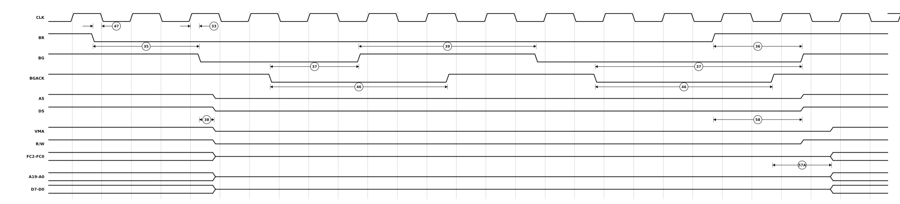

# Figure 10-11. Bus Arbitration Timing — Multiple Bus Request

Redrawn from **Figure 10-11** of the M68000 8-/16-/32-Bit Microprocessors
User's Manual (PDF page 173, printed page 10-22 — see
[`13-section-10-electrical-and-thermal-characteristics.pdf`](13-section-10-electrical-and-thermal-characteristics.pdf) page 22 for the original scan).

Two alternate masters in succession. `BR` stays asserted across both grants — that is how the processor is told someone else is still waiting — and is negated only before the last one ends. `BG` is dropped between grants, and specification 39 is the minimum width of that gap.



## Specifications marked on this figure

<!-- BEGIN TABLE from=ac-electrical-specifications.csv table=bus-arbitration grades=m68000 nums=33|35|36|37|38|39|46|47|57A|58 -->
| Num. | Characteristic | Unit | 8 MHz<sup>&ast;</sup> | 10 MHz<sup>&ast;</sup> | 12.5 MHz<sup>&ast;</sup> | 16.67 MHz 12F | 16 MHz | 20 MHz<sup>&ast;&ast;</sup> |
|:-:|---|:-:|--:|--:|--:|--:|--:|--:|
| 33 | Clock High to BG Asserted | ns | ≤ 62 | ≤ 50 | ≤ 40 | 0&nbsp;–&nbsp;40 | 0&nbsp;–&nbsp;30 | 0&nbsp;–&nbsp;25 |
| 35 | BR Asserted to BG Asserted | Clks | 1.5&nbsp;–&nbsp;3.5 | 1.5&nbsp;–&nbsp;3.5 | 1.5&nbsp;–&nbsp;3.5 | 1.5&nbsp;–&nbsp;3.5 | 1.5&nbsp;–&nbsp;3.5 | 1.5&nbsp;–&nbsp;3.5 |
| 36<sup>1</sup> | BR Negated to BG Negated | Clks | 1.5&nbsp;–&nbsp;3.5 | 1.5&nbsp;–&nbsp;3.5 | 1.5&nbsp;–&nbsp;3.5 | 1.5&nbsp;–&nbsp;3.5 | 1.5&nbsp;–&nbsp;3.5 | 1.5&nbsp;–&nbsp;3.5 |
| 37 | BGACK Asserted to BG Negated | Clks | 1.5&nbsp;–&nbsp;3.5 | 1.5&nbsp;–&nbsp;3.5 | 1.5&nbsp;–&nbsp;3.5 | 1.5&nbsp;–&nbsp;3.5 | 1.5&nbsp;–&nbsp;3.5 | 1.5&nbsp;–&nbsp;3.5 |
| 38 | BG Asserted to Control, Address, Data Bus High Impedance (AS Negated) | ns | ≤ 80 | ≤ 70 | ≤ 60 | ≤ 50 | ≤ 50 | ≤ 42 |
| 39 | BG Width Negated | Clks | ≥ 1.5 | ≥ 1.5 | ≥ 1.5 | ≥ 1.5 | ≥ 1.5 | ≥ 1.5 |
| 46 | BGACK Width Low | Clks | ≥ 1.5 | ≥ 1.5 | ≥ 1.5 | ≥ 1.5 | ≥ 1.5 | ≥ 1.5 |
| 47 | Asynchronous Input Setup Time | ns | ≥ 10 | ≥ 10 | ≥ 10 | ≥ 5 | ≥ 5 | ≥ 5 |
| 57A | BGACK Negated to FC, VMA Driven | Clks | ≥ 1 | ≥ 1 | ≥ 1 | ≥ 1 | ≥ 1 | ≥ 1 |
| 58<sup>1</sup> | BR Negated to AS, DS, R/W Driven | Clks | ≥ 1.5 | ≥ 1.5 | ≥ 1.5 | ≥ 1.5 | ≥ 1.5 | ≥ 1.5 |

- **&ast;** These specifications represent an improvement over previously published specifications for the 8-, 10-, and 12.5-MHz MC68000 and are valid only for product bearing date codes of 8827 and later.
- **&ast;&ast;** Applies only to the MC68HC000 and MC68HC001.
- **1** Setup time for the synchronous inputs BGACK, IPL0-IPL2, and VPA guarantees their recognition at the next falling edge of the clock.
<!-- END TABLE -->

A range `a – b` is min–max; `≤ b` is a maximum with no minimum specified; `≥ a`
is a minimum with no maximum; `—` is not specified at that grade. Superscripts
are the source table's own footnotes; the ones below the table are that
table's, and only the ones these rows actually reference are printed. Test
conditions and the source page of every row are in
[`ac-electrical-specifications.csv`](ac-electrical-specifications.csv), and
every footnote of all seven tables — including the ones no figure references —
is in [`ac-table-notes.csv`](ac-table-notes.csv).

## About this redrawing

The source figure carries no state ruler and compresses its middle with a drafting break, so it has no horizontal scale to recover. This redrawing runs the whole sequence at one scale instead, at event times chosen so that **every specification the figure marks holds at once** — the arithmetic is in the `ARBITRATION` block of `make-figure-svg.py`.

**Callout anchors follow what each specification measures**, per its
description in [`ac-electrical-specifications.csv`](ac-electrical-specifications.csv),
rather than the pixel position of the arrowhead on the scan. Where the two
disagree the CSV wins, because the CSV is where the numbers live.

Overbars are lost in the redrawing: `AS`, `DS`, `UDS`, `LDS`, `DTACK`, `BERR`,
`BR`, `BG`, `BGACK`, `HALT`, `RESET`, `VMA` and `VPA` are all active low.
A signal drawn on a mid-rail line is not being driven at all.

Rendered as a plain SVG referenced as an image, which is the only diagram
format that survives GitHub's markdown pipeline — GitHub supports no waveform
syntax (Mermaid has none) and strips inline `<svg>`. The figure adapts to
light and dark themes.

## Regenerating

```sh
python3 make-figure-svg.py 11      # redraw this figure
python3 make-figure-tables.py         # refresh the table above from the CSV
```
