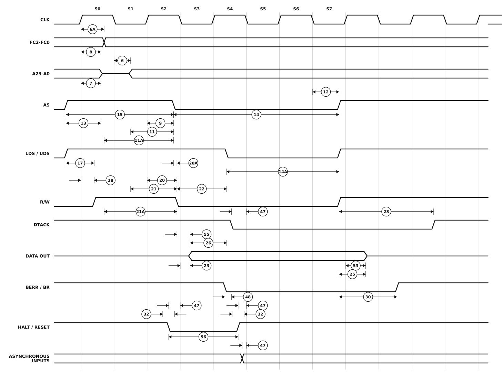

# Figure 10-13. MC68EC000 Write Cycle Timing Diagram

Redrawn from **Figure 10-13** of the M68000 8-/16-/32-Bit Microprocessors
User's Manual (PDF page 178, printed page 10-27 — see
[`13-section-10-electrical-and-thermal-characteristics.pdf`](13-section-10-electrical-and-thermal-characteristics.pdf) page 27 for the original scan).

The MC68EC000 write cycle, structurally identical to Figure 10-5. The source labels the address bus A23-A0 here where Figure 10-5 labels it A23-A1.



## Specifications marked on this figure

<!-- BEGIN TABLE from=ac-electrical-specifications.csv table=mc68ec000-read-write grades=mc68ec000 nums=6|6A|7|8|9|11|11A|12|13|14|14A|15|17|18|20|20A|21|21A|22|23|25|26|28|30|32|47|48|53|55|56 -->
| Num. | Characteristic | Unit | 8 MHz | 10 MHz | 12.5 MHz | 16.67 MHz | 20 MHz |
|:-:|---|:-:|--:|--:|--:|--:|--:|
| 6 | Clock Low to Address Valid | ns | ≤ 35 | ≤ 35 | ≤ 35 | ≤ 30 | ≤ 25 |
| 6A | Clock High to FC Valid | ns | ≤ 35 | ≤ 35 | ≤ 35 | ≤ 30 | 0&nbsp;–&nbsp;25 |
| 7 | Clock High to Address, Data Bus High Impedance (Maximum) | ns | ≤ 55 | ≤ 55 | ≤ 55 | ≤ 50 | ≤ 42 |
| 8 | Clock High to Address, FC Invalid (Minimum) | ns | ≥ 0 | ≥ 0 | ≥ 0 | ≥ 0 | ≥ 0 |
| 9<sup>1</sup> | Clock High to AS, DS Asserted | ns | 3&nbsp;–&nbsp;35 | 3&nbsp;–&nbsp;35 | 3&nbsp;–&nbsp;35 | 3&nbsp;–&nbsp;30 | 3&nbsp;–&nbsp;25 |
| 11<sup>2</sup> | Address Valid to AS, DS Asserted (Read)/AS Asserted (Write) | ns | ≥ 30 | ≥ 20 | ≥ 15 | ≥ 15 | ≥ 10 |
| 11A<sup>2</sup> | FC Valid to AS, DS Asserted (Read)/AS Asserted (Write) | ns | ≥ 45 | ≥ 45 | ≥ 45 | ≥ 45 | ≥ 40 |
| 12<sup>1</sup> | Clock Low to AS, DS Negated | ns | 3&nbsp;–&nbsp;35 | 3&nbsp;–&nbsp;35 | 3&nbsp;–&nbsp;35 | 3&nbsp;–&nbsp;30 | 3&nbsp;–&nbsp;25 |
| 13<sup>2</sup> | AS, DS Negated to Address, FC Invalid | ns | ≥ 15 | ≥ 15 | ≥ 15 | ≥ 15 | ≥ 10 |
| 14<sup>2</sup> | AS (and DS Read) Width Asserted | ns | ≥ 270 | ≥ 195 | ≥ 160 | ≥ 120 | ≥ 100 |
| 14A<sup>2</sup> | DS Width Asserted (Write) | ns | ≥ 140 | ≥ 95 | ≥ 80 | ≥ 60 | ≥ 50 |
| 15<sup>2</sup> | AS, DS Width Negated | ns | ≥ 150 | ≥ 105 | ≥ 65 | ≥ 60 | ≥ 50 |
| 17<sup>2</sup> | AS, DS Negated to R/W Invalid | ns | ≥ 15 | ≥ 15 | ≥ 15 | ≥ 15 | ≥ 10 |
| 18<sup>1</sup> | Clock High to R/W High (Read) | ns | 0&nbsp;–&nbsp;35 | 0&nbsp;–&nbsp;35 | 0&nbsp;–&nbsp;35 | 0&nbsp;–&nbsp;30 | 0&nbsp;–&nbsp;25 |
| 20<sup>1</sup> | Clock High to R/W Low (Write) | ns | 0&nbsp;–&nbsp;35 | 0&nbsp;–&nbsp;35 | 0&nbsp;–&nbsp;35 | 0&nbsp;–&nbsp;30 | 0&nbsp;–&nbsp;25 |
| 20A<sup>2,6</sup> | AS Asserted to R/W Low (Write) | ns | ≤ 10 | ≤ 10 | ≤ 10 | ≤ 10 | ≤ 10 |
| 21<sup>2</sup> | Address Valid to R/W Low (Write) | ns | ≥ 0 | ≥ 0 | ≥ 0 | ≥ 0 | ≥ 0 |
| 21A<sup>2</sup> | FC Valid to R/W Low (Write) | ns | ≥ 60 | ≥ 50 | ≥ 30 | ≥ 30 | ≥ 25 |
| 22<sup>2</sup> | R/W Low to DS Asserted (Write) | ns | ≥ 80 | ≥ 50 | ≥ 30 | ≥ 30 | ≥ 25 |
| 23 | Clock Low to Data-Out Valid (Write) | ns | ≤ 35 | ≤ 35 | ≤ 35 | ≤ 30 | ≤ 25 |
| 25<sup>2</sup> | AS, DS Negated to Data-Out Invalid (Write) | ns | ≥ 40 | ≥ 30 | ≥ 20 | ≥ 15 | ≥ 10 |
| 26<sup>2</sup> | Data-Out Valid to DS Asserted (Write) | ns | ≥ 40 | ≥ 30 | ≥ 20 | ≥ 15 | ≥ 10 |
| 28<sup>2</sup> | AS, DS Negated to DTACK Negated (Asynchronous Hold) | ns | 0&nbsp;–&nbsp;110 | 0&nbsp;–&nbsp;110 | 0&nbsp;–&nbsp;110 | 0&nbsp;–&nbsp;110 | 0&nbsp;–&nbsp;95 |
| 30 | AS, DS Negated to BERR Negated | ns | ≥ 0 | ≥ 0 | ≥ 0 | ≥ 0 | ≥ 0 |
| 32 | HALT and RESET Input Transition Time | ns | 0&nbsp;–&nbsp;150 | 0&nbsp;–&nbsp;150 | 0&nbsp;–&nbsp;150 | 0&nbsp;–&nbsp;150 | 0&nbsp;–&nbsp;150 |
| 47<sup>5</sup> | Asynchronous Input Setup Time | ns | ≥ 5 | ≥ 5 | ≥ 5 | ≥ 5 | ≥ 5 |
| 48<sup>2,3</sup> | BERR Asserted to DTACK Asserted | ns | ≥ 20 | ≥ 20 | ≥ 20 | ≥ 10 | ≥ 10 |
| 53 | Data-Out Hold from Clock High | ns | ≥ 0 | ≥ 0 | ≥ 0 | ≥ 0 | ≥ 0 |
| 55 | R/W Asserted to Data Bus Impedance Change | ns | ≥ 30 | ≥ 20 | ≥ 10 | ≥ 0 | ≥ 0 |
| 56<sup>4</sup> | HALT/RESET Pulse Width | Clks | ≥ 10 | ≥ 10 | ≥ 10 | ≥ 10 | ≥ 10 |

- **1** For a loading capacitance of less than or equal to 50 pF, subtract 5 ns from the value given in the maximum columns.
- **2** Actual value depends on clock period.
- **3** If #47 is satisfied for both DTACK and BERR, #48 may be ignored. In the absence of DTACK, BERR is an asynchronous input using the asynchronous input setup time (#47).
- **4** For power-up, the MC68EC000 must be held in the reset state for 520 clocks to allow stabilization of on-chip circuitry. After the system is powered up, #56 refers to the minimum pulse width required to reset the processor.
- **5** If the asynchronous input setup time (#47) requirement is satisfied for DTACK, the DTACK-asserted to data setup time (#31) requirement can be ignored. The data must only satisfy the data-in to clock low setup time (#27) for the following clock cycle.
- **6** When AS and R/W are equally loaded (+/-20 %), subtract 5 ns from the values given in these columns.
<!-- END TABLE -->

A range `a – b` is min–max; `≤ b` is a maximum with no minimum specified; `≥ a`
is a minimum with no maximum; `—` is not specified at that grade. Superscripts
are the source table's own footnotes; the ones below the table are that
table's, and only the ones these rows actually reference are printed. Test
conditions and the source page of every row are in
[`ac-electrical-specifications.csv`](ac-electrical-specifications.csv), and
every footnote of all seven tables — including the ones no figure references —
is in [`ac-table-notes.csv`](ac-table-notes.csv).

Specification 32 is the input transition time — the ramp on `HALT`/`RESET`
itself. The engine draws every edge with the same short ramp, so there is no
drawn ramp to measure; the two 32 callouts are given a visible width centred
on the transition instead.

## About this redrawing

The horizontal axis is the source's own bus-state ruler, recovered by measurement: on page 10-13 the printed S0-S7 labels sit 89 px apart at 300 dpi and each is centred on a clock plateau, so the state boundaries fall halfway between labels. Every edge below is drawn at the time the source draws it, delays included.

**Callout anchors follow what each specification measures**, per its
description in [`ac-electrical-specifications.csv`](ac-electrical-specifications.csv),
rather than the pixel position of the arrowhead on the scan. Where the two
disagree the CSV wins, because the CSV is where the numbers live.

Overbars are lost in the redrawing: `AS`, `DS`, `UDS`, `LDS`, `DTACK`, `BERR`,
`BR`, `BG`, `BGACK`, `HALT`, `RESET`, `VMA` and `VPA` are all active low.
A signal drawn on a mid-rail line is not being driven at all.

Rendered as a plain SVG referenced as an image, which is the only diagram
format that survives GitHub's markdown pipeline — GitHub supports no waveform
syntax (Mermaid has none) and strips inline `<svg>`. The figure adapts to
light and dark themes.

## Regenerating

```sh
python3 make-figure-svg.py 13      # redraw this figure
python3 make-figure-tables.py         # refresh the table above from the CSV
```
