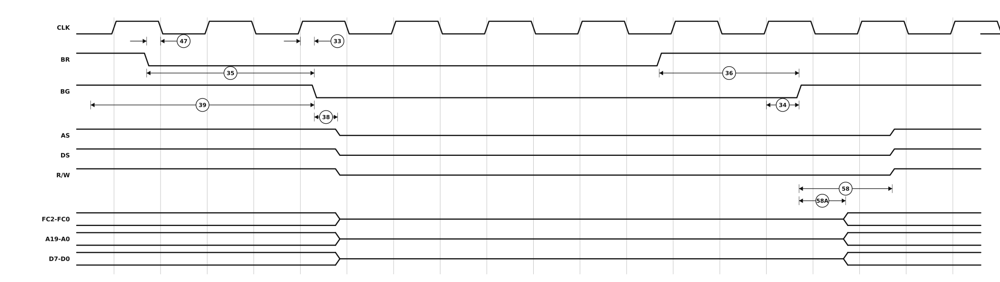

# Figure 10-14. MC68EC000 Bus Arbitration Timing Diagram

Redrawn from **Figure 10-14** of the M68000 8-/16-/32-Bit Microprocessors
User's Manual (PDF page 180, printed page 10-29 — see
[`13-section-10-electrical-and-thermal-characteristics.pdf`](13-section-10-electrical-and-thermal-characteristics.pdf) page 29 for the original scan).

The MC68EC000 arbitrates with two wires: it has no `BGACK` pin, so the bus comes back when `BR` is negated rather than when an acknowledgement is withdrawn. It has no `VMA` either.



## Specifications marked on this figure

<!-- BEGIN TABLE from=ac-electrical-specifications.csv table=mc68ec000-bus-arbitration grades=mc68ec000 nums=33|34|35|36|38|39|47|58|58A -->
| Num. | Characteristic | Unit | 8 MHz | 10 MHz | 12.5 MHz | 16.67 MHz | 20 MHz |
|:-:|---|:-:|--:|--:|--:|--:|--:|
| 33 | Clock High to BG Asserted | ns | ≤ 35 | ≤ 35 | ≤ 35 | 0&nbsp;–&nbsp;30 | 0&nbsp;–&nbsp;25 |
| 34 | Clock High to BG Negated | ns | ≤ 35 | ≤ 35 | ≤ 35 | 0&nbsp;–&nbsp;30 | 0&nbsp;–&nbsp;25 |
| 35 | BR Asserted to BG Asserted | Clks | 1.5&nbsp;–&nbsp;3.5 | 1.5&nbsp;–&nbsp;3.5 | 1.5&nbsp;–&nbsp;3.5 | 1.5&nbsp;–&nbsp;3.5 | 1.5&nbsp;–&nbsp;3.5 |
| 36<sup>7</sup> | BR Negated to BG Negated | Clks | 1.5&nbsp;–&nbsp;3.5 | 1.5&nbsp;–&nbsp;3.5 | 1.5&nbsp;–&nbsp;3.5 | 1.5&nbsp;–&nbsp;3.5 | 1.5&nbsp;–&nbsp;3.5 |
| 38 | BG Asserted to Control, Address, Data Bus High Impedance (AS Negated) | ns | ≤ 55 | ≤ 55 | ≤ 55 | ≤ 50 | ≤ 42 |
| 39 | BG Width Negated | Clks | ≥ 1.5 | ≥ 1.5 | ≥ 1.5 | ≥ 1.5 | ≥ 1.5 |
| 47 | Asynchronous Input Setup Time | ns | ≥ 5 | ≥ 5 | ≥ 5 | ≥ 5 | ≥ 5 |
| 58<sup>1</sup> | BR Negated to AS, DS, R/W Driven | Clks | ≥ 1.5 | ≥ 1.5 | ≥ 1.5 | ≥ 1.5 | ≥ 1.5 |
| 58A<sup>1</sup> | BR Negated to FC Driven | Clks | ≥ 1 | ≥ 1 | ≥ 1 | ≥ 1 | ≥ 1 |
<!-- END TABLE -->

A range `a – b` is min–max; `≤ b` is a maximum with no minimum specified; `≥ a`
is a minimum with no maximum; `—` is not specified at that grade. The
superscript on a specification number is its footnote in the source table.
Full descriptions, footnotes, test conditions and the source page of every row
are in [`ac-electrical-specifications.csv`](ac-electrical-specifications.csv).

## About this redrawing

The source figure carries no state ruler and compresses its middle with a drafting break, so it has no horizontal scale to recover. This redrawing runs the whole sequence at one scale instead, at event times chosen so that **every specification the figure marks holds at once** — the arithmetic is in the `ARBITRATION` block of `make-figure-svg.py`.

**Callout anchors follow what each specification measures**, per its
description in [`ac-electrical-specifications.csv`](ac-electrical-specifications.csv),
rather than the pixel position of the arrowhead on the scan. Where the two
disagree the CSV wins, because the CSV is where the numbers live.

Overbars are lost in the redrawing: `AS`, `DS`, `UDS`, `LDS`, `DTACK`, `BERR`,
`BR`, `BG`, `BGACK`, `HALT`, `RESET`, `VMA` and `VPA` are all active low.
A signal drawn on a mid-rail line is not being driven at all.

Rendered as a plain SVG referenced as an image, which is the only diagram
format that survives GitHub's markdown pipeline — GitHub supports no waveform
syntax (Mermaid has none) and strips inline `<svg>`. The figure adapts to
light and dark themes.

## Regenerating

```sh
python3 make-figure-svg.py 14      # redraw this figure
python3 make-figure-tables.py         # refresh the table above from the CSV
```
