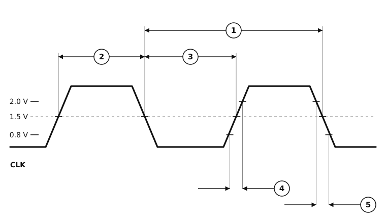

# Figure 10-2. Clock Input Timing Diagram

MC68020/MC68EC020 User's Manual, printed page 10-7 (PDF page 281 of `../MC68020UM.pdf`).

The horizontal axis is time, with no scale. The callouts mark what each specification measures, not how long it is.

## Specifications marked on this figure

Every specification the figure marks, at all four speed grades, as printed in Section 10. An em dash is the manual's own "not specified"; a `*` against a number means the MC68EC020 has no such signal. The footnotes below the table are the ones these rows reference - [`ac-table-notes.csv`](ac-table-notes.csv) holds all of them.

| Spec | Characteristic | 16.67 MHz min | 16.67 MHz max | 20 MHz min | 20 MHz max | 25 MHz min | 25 MHz max | 33.33 MHz min | 33.33 MHz max | Unit |
|---|---|--:|--:|--:|--:|--:|--:|--:|--:|---|
| 1 | Cycle Time | 60 | 125 | 50 | 80 | 40 | 80 | 30 | 80 | ns |
| 2,3 | Clock Pulse Width (Measured from 1.5 V to 1.5 V) | 24 | 95 | 20 | 54 | 19 | 61 | 14 | 66 | ns |
| 4,5 | Clock Rise and Fall Times | — | 5 | — | 5 | — | 4 | — | 3 | ns |

### Footnotes

- **&ast;** These specifications represent an improvement over previously published specifications for the 25-MHz MC68020 and are valid only for products bearing date codes of 8827 and later. 1 2 3 2.0 V 0.8 V 4 5 NOTE:Timing measurements are referenced to and from a low voltage of .08 V and a high voltage of 2.0 V, unless othervise noted. The voltage swing through this r a should start outside and pass through the range such that the rise or fall w between 0.8 V and 2.0 V. FIGURE 10-2 MC68020UM Figure 10-2. Clock Input Timing Diagram

The figure is drawn by hand, because it has no bus states to lay out against. Regenerate this page with `python3 make-figure-pages.py`.
