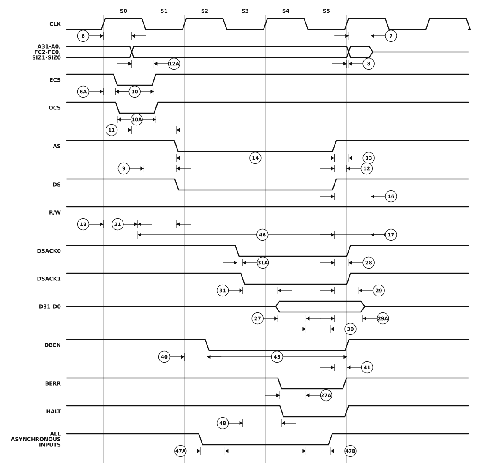

# Figure 10-3. Read Cycle Timing Diagram

MC68020/MC68EC020 User's Manual, printed page 10-11 (PDF page 285 of `../MC68020UM.pdf`).

The horizontal axis is bus states, six of which - S0 to S5 - are labelled as the source labels them. Placement is schematic, as it is in the manual: the edge ramps are exaggerated and nothing is to scale. Read the ordering and what each callout measures from the diagram, and the numbers from the table.

## Specifications marked on this figure

Every specification the figure marks, at all four speed grades, as printed in Section 10. An em dash is the manual's own "not specified"; a `*` against a number means the MC68EC020 has no such signal. The footnotes below the table are the ones these rows reference - [`ac-table-notes.csv`](ac-table-notes.csv) holds all of them.

| Spec | Characteristic | 16.67 MHz min | 16.67 MHz max | 20 MHz min | 20 MHz max | 25 MHz min | 25 MHz max | 33.33 MHz min | 33.33 MHz max | Unit |
|---|---|--:|--:|--:|--:|--:|--:|--:|--:|---|
| 6 | Clock High to FC, Size, RMC, Address Valid | 0 | 30 | 0 | 25 | 0 | 25 | 0 | 21 | ns |
| 6A&ast; | Clock High to ECS, OCS Asserted | 0 | 20 | 0 | 15 | 0 | 12 | 0 | 10 | ns |
| 7 | Clock High to Address, Data, FC, Size, RMC High Impedance | 0 | 60 | 0 | 50 | 0 | 40 | 0 | 30 | ns |
| 8 | Clock High to Address, FC, Size, RMC Invalid | 0 | — | 0 | — | 0 | — | 0 | — | ns |
| 9 | Clock Low to AS, DS Asserted | 3 | 30 | 3 | 25 | 3 | 18 | 3 | 15 | ns |
| 10A&ast; | OCS Width Asserted | 20 | — | 15 | — | 15 | — | 10 | — | ns |
| 11 | Address, FC, Size, RMC Valid to AS (and DS Asserted, Read) | 15 | — | 10 | — | 6 | — | 5 | — | ns |
| 12 | Clock Low to AS, DS Negated | 0 | 30 | 0 | 25 | 0 | 15 | 0 | 15 | ns |
| 12A&ast; | Clock Low to ECS, OCS Negated | 0 | 30 | 0 | 25 | 0 | 15 | 0 | 15 | ns |
| 13 | AS, DS Negated to Address, FC, Size, RMC Invalid | 15 | — | 10 | — | 10 | — | 5 | — | ns |
| 14 | AS (and DS Read) Width Asserted | 100 | — | 85 | — | 70 | — | 50 | — | ns |
| 16 | Clock High to AS, DS, R/W, DBEN High Impedance | — | 60 | — | 50 | — | 40 | — | 30 | ns |
| 17 | AS, DS Negated to R/W Invalid | 15 | — | 10 | — | 10 | — | 5 | — | ns |
| 18 | Clock High to R/W High | 0 | 30 | 0 | 25 | 0 | 20 | 0 | 15 | ns |
| 21 | R/W High to AS Asserted (Read) | 15 | — | 10 | — | 5 | — | 5 | — | ns |
| 27 | Data-In Valid to Clock Low (Setup) (Read) | 5 | — | 5 | — | 5 | — | 5 | — | ns |
| 27A | Late BERR/HALT Asserted to Clock Low (Setup) | 20 | — | 15 | — | 10 | — | 5 | — | ns |
| 28 | AS, DS Negated to DSACK≈, BERR, HALT, AVEC Negated | 0 | 80 | 0 | 65 | 0 | 50 | 0 | 40 | ns |
| 29 | AS, DS Negated to Data-In Invalid (Data-In Hold Time) | 0 | — | 0 | — | 0 | — | 0 | — | ns |
| 29A | AS, DS Negated to Data-In (High Impedance) | — | 60 | — | 50 | — | 40 | — | 30 | ns |
| 30 | Clock Low to Data-In Invalid (Data-In Hold Time) | 15 | — | 15 | — | 10 | — | 10 | — | ns |
| 312 | DSACK≈ Asserted to Data-In Valid | — | 50 | — | 43 | — | 32 | — | 17 | ns |
| 31A3 | DSACK≈ Asserted to DSACK≈ Valid (DSACK≈ Asserted Skew) | — | 15 | — | 10 | — | 10 | — | 10 | ns |
| 40&ast; | Clock High to DBEN Asserted (Read) | 0 | 30 | 0 | 25 | 0 | 20 | 0 | 15 | ns |
| 41&ast; | Clock Low to DBEN Negated (Read) | 0 | 30 | 0 | 25 | 0 | 20 | 0 | 15 | ns |
| 45&ast;,5 | DBEN Width Asserted (Read) | 60 | — | 50 | — | 40 | — | 30 | — | ns |
| 45&ast;,5 | DBEN Width Asserted (Write) | 120 | — | 100 | — | 80 | — | 60 | — | ns |
| 46 | R/W Width Valid (Write or Read) | 150 | — | 125 | — | 100 | — | 75 | — | ns |
| 47A | Asynchronous Input Setup Time | 5 | — | 5 | — | 5 | — | 5 | — | ns |
| 47B | Asynchronous Input Hold Time | 15 | — | 15 | — | 10 | — | 10 | — | ns |
| 484 | DSACK≈ Asserted to BERR, HALT Asserted | — | 30 | — | 20 | — | 18 | — | 15 | ns |

### Footnotes

- **&ast;** This specification does not apply to the MC68EC020.
- **&ast;&ast;** These specifications represent an improvement over previously published specifications for the 25-MHz MC68020 and are valid only for product bearing date codes of 8827 and later.
- **2** If the asynchronous setup time (#47A) requirements are satisfied, the DSACK≈ low to data setup time (#31) and DSACK≈ low to BERR low setup time (#48) can be ignored. The data must only satisfy the data-in clock low setup time (#27) for the following clock cycle, and BERR must only satisfy the late BERR low to clock low setup time (#27A) for the following clock cycle.
- **3** This parameter specifies the maximum allowable skew between DSACK0 to DSACK1 asserted or DSACK1 to DSACK0 asserted; specification #47A must be met by DSACK0 or DSACK1.
- **4** This specification applies to the first (DSACK0 or DSACK1) DSACK≈ signal asserted. In the absence of DSACK≈, BERR is an asynchronous input using the asynchronous input setup time (#47A).
- **5** DBEN may stay asserted on consecutive write cycles.

The figure is generated by `make-figure-svg.py`. Regenerate this page with `python3 make-figure-pages.py`.
