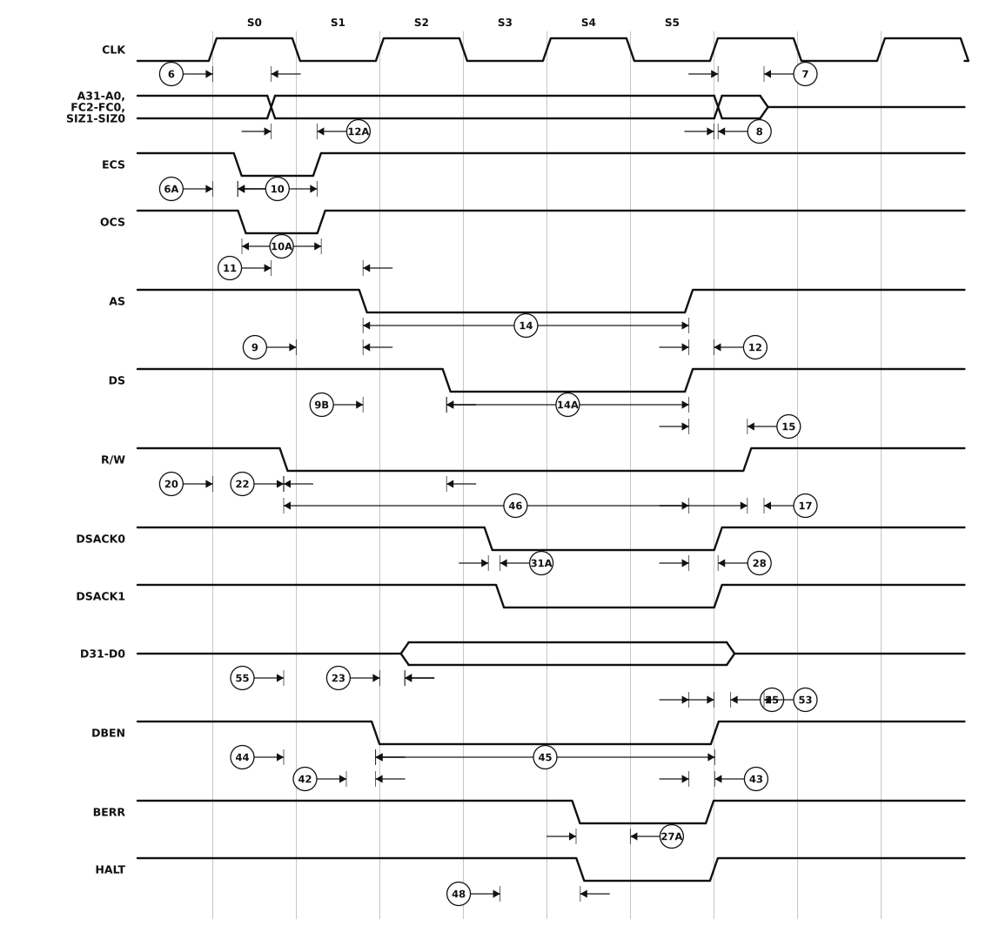

# Figure 10-4. Write Cycle Timing Diagram

MC68020/MC68EC020 User's Manual, printed page 10-12 (PDF page 286 of `../MC68020UM.pdf`).

The horizontal axis is bus states, six of which - S0 to S5 - are labelled as the source labels them. Placement is schematic, as it is in the manual: the edge ramps are exaggerated and nothing is to scale. Read the ordering and what each callout measures from the diagram, and the numbers from the table.

## Specifications marked on this figure

Every specification the figure marks, at all four speed grades, as printed in Section 10. An em dash is the manual's own "not specified"; a `*` against a number means the MC68EC020 has no such signal. The footnotes below the table are the ones these rows reference - [`ac-table-notes.csv`](ac-table-notes.csv) holds all of them.

| Spec | Characteristic | 16.67 MHz min | 16.67 MHz max | 20 MHz min | 20 MHz max | 25 MHz min | 25 MHz max | 33.33 MHz min | 33.33 MHz max | Unit |
|---|---|--:|--:|--:|--:|--:|--:|--:|--:|---|
| 6 | Clock High to FC, Size, RMC, Address Valid | 0 | 30 | 0 | 25 | 0 | 25 | 0 | 21 | ns |
| 6A&ast; | Clock High to ECS, OCS Asserted | 0 | 20 | 0 | 15 | 0 | 12 | 0 | 10 | ns |
| 7 | Clock High to Address, Data, FC, Size, RMC High Impedance | 0 | 60 | 0 | 50 | 0 | 40 | 0 | 30 | ns |
| 8 | Clock High to Address, FC, Size, RMC Invalid | 0 | — | 0 | — | 0 | — | 0 | — | ns |
| 9 | Clock Low to AS, DS Asserted | 3 | 30 | 3 | 25 | 3 | 18 | 3 | 15 | ns |
| 10&ast; | ECS Width Asserted | 20 | — | 15 | — | 15 | — | 10 | — | ns |
| 11 | Address, FC, Size, RMC Valid to AS (and DS Asserted, Read) | 15 | — | 10 | — | 6 | — | 5 | — | ns |
| 12 | Clock Low to AS, DS Negated | 0 | 30 | 0 | 25 | 0 | 15 | 0 | 15 | ns |
| 12A&ast; | Clock Low to ECS, OCS Negated | 0 | 30 | 0 | 25 | 0 | 15 | 0 | 15 | ns |
| 13 | AS, DS Negated to Address, FC, Size, RMC Invalid | 15 | — | 10 | — | 10 | — | 5 | — | ns |
| 14 | AS (and DS Read) Width Asserted | 100 | — | 85 | — | 70 | — | 50 | — | ns |
| 14A | DS Width Asserted (Write) | 40 | — | 38 | — | 30 | — | 25 | — | ns |
| 15 | AS, DS Width Negated | 40 | — | 38 | — | 30 | — | 23 | — | ns |
| 17 | AS, DS Negated to R/W Invalid | 15 | — | 10 | — | 10 | — | 5 | — | ns |
| 20 | Clock High to R/W Low | 0 | 30 | 0 | 25 | 0 | 20 | 0 | 15 | ns |
| 22 | R/W Low to DS Asserted (Write) | 75 | — | 60 | — | 50 | — | 35 | — | ns |
| 23 | Clock High to Data-Out Valid | — | 30 | — | 25 | — | 25 | — | 18 | ns |
| 25 | AS, DS Negated to Data-Out Invalid | 15 | — | 10 | — | 5 | — | 5 | — | ns |
| 25A&ast;,9 | DS Negated to DBEN Negated (Write) | 15 | — | 10 | — | 5 | — | 5 | — | ns |
| 26 | Data-Out Valid to DS Asserted (Write) | 15 | — | 10 | — | 5 | — | 5 | — | ns |
| 28 | AS, DS Negated to DSACK≈, BERR, HALT, AVEC Negated | 0 | 80 | 0 | 65 | 0 | 50 | 0 | 40 | ns |
| 31A3 | DSACK≈ Asserted to DSACK≈ Valid (DSACK≈ Asserted Skew) | — | 15 | — | 10 | — | 10 | — | 10 | ns |
| 42&ast; | Clock Low to DBEN Asserted (Write) | 0 | 30 | 0 | 25 | 0 | 20 | 0 | 15 | ns |
| 43&ast; | Clock High to DBEN Negated (Write) | 0 | 30 | 0 | 25 | 0 | 20 | 0 | 15 | ns |
| 44&ast; | R/W Low to DBEN Asserted (Write) | 15 | — | 10 | — | 10 | — | 5 | — | ns |
| 45&ast;,5 | DBEN Width Asserted (Read) | 60 | — | 50 | — | 40 | — | 30 | — | ns |
| 45&ast;,5 | DBEN Width Asserted (Write) | 120 | — | 100 | — | 80 | — | 60 | — | ns |
| 46 | R/W Width Valid (Write or Read) | 150 | — | 125 | — | 100 | — | 75 | — | ns |
| 484 | DSACK≈ Asserted to BERR, HALT Asserted | — | 30 | — | 20 | — | 18 | — | 15 | ns |
| 53 | Data-Out Hold from Clock High | 0 | — | 0 | — | 0 | — | 0 | — | ns |
| 55 | R/W Valid to Data Bus Impedance Change | 30 | — | 25 | — | 20 | — | 20 | — | ns |

### Footnotes

- **&ast;** This specification does not apply to the MC68EC020.
- **&ast;&ast;** These specifications represent an improvement over previously published specifications for the 25-MHz MC68020 and are valid only for product bearing date codes of 8827 and later.
- **3** This parameter specifies the maximum allowable skew between DSACK0 to DSACK1 asserted or DSACK1 to DSACK0 asserted; specification #47A must be met by DSACK0 or DSACK1.
- **4** This specification applies to the first (DSACK0 or DSACK1) DSACK≈ signal asserted. In the absence of DSACK≈, BERR is an asynchronous input using the asynchronous input setup time (#47A).
- **5** DBEN may stay asserted on consecutive write cycles.
- **9** This specification allows a system designer to guarantee data hold times on the output side of data buffers that have output enable signals generated with DBEN.

The figure is generated by `make-figure-svg.py`. Regenerate this page with `python3 make-figure-pages.py`.
