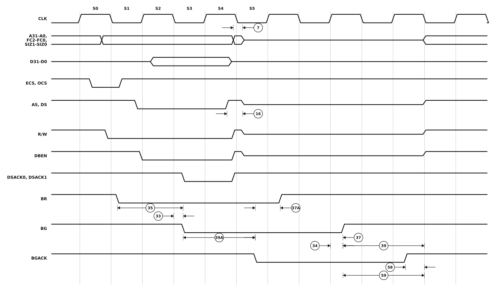

# Figure 10-5. Bus Arbitration Timing Diagram

MC68020/MC68EC020 User's Manual, printed page 10-13 (PDF page 287 of `../MC68020UM.pdf`).

The horizontal axis is bus states, six of which - S0 to S5 - are labelled as the source labels them. Placement is schematic, as it is in the manual: the edge ramps are exaggerated and nothing is to scale. Read the ordering and what each callout measures from the diagram, and the numbers from the table.

## Specifications marked on this figure

Every specification the figure marks, at all four speed grades, as printed in Section 10. An em dash is the manual's own "not specified"; a `*` against a number means the MC68EC020 has no such signal. The footnotes below the table are the ones these rows reference - [`ac-table-notes.csv`](ac-table-notes.csv) holds all of them.

| Spec | Characteristic | 16.67 MHz min | 16.67 MHz max | 20 MHz min | 20 MHz max | 25 MHz min | 25 MHz max | 33.33 MHz min | 33.33 MHz max | Unit |
|---|---|--:|--:|--:|--:|--:|--:|--:|--:|---|
| 7 | Clock High to Address, Data, FC, Size, RMC High Impedance | 0 | 60 | 0 | 50 | 0 | 40 | 0 | 30 | ns |
| 16 | Clock High to AS, DS, R/W, DBEN High Impedance | — | 60 | — | 50 | — | 40 | — | 30 | ns |
| 33 | Clock Low to BG Asserted | 0 | 30 | 0 | 25 | 0 | 20 | 0 | 20 | ns |
| 34 | Clock Low to BG Negated | 0 | 30 | 0 | 25 | 0 | 20 | 0 | 20 | ns |
| 35 | BR Asserted to BG Asserted (RMC Not Asserted) | 1.5 | 3.5 | 1.5 | 3.5 | 1.5 | 3.5 | 1.5 | 3.5 | Clks |
| 37&ast; | BGACK Asserted to BG Negated | 1.5 | 3.5 | 1.5 | 3.5 | 1.5 | 3.5 | 1.5 | 3.5 | Clks |
| 37A&ast;,6 | BGACK Asserted to BR Negated | 0 | 1.5 | 0 | 1.5 | 0 | 1.5 | 0 | 1.5 | Clks |
| 39 | BG Width Negated | 90 | — | 75 | — | 60 | — | 50 | — | ns |
| 39A | BG Width Asserted | 90 | — | 75 | — | 60 | — | 50 | — | ns |
| 58&ast;,10 | BGACK Negated to Bus Driven | 1 | — | 1 | — | 1 | — | 1 | — | Clks |
| 5910 | BG Negated to Bus Driven | 1 | — | 1 | — | 1 | — | 1 | — | Clks |

### Footnotes

- **&ast;** This specification does not apply to the MC68EC020.
- **&ast;&ast;** These specifications represent an improvement over previously published specifications for the 25-MHz MC68020 and are valid only for product bearing date codes of 8827 and later.
- **6** The minimum values must be met to guarantee proper operation. If this maximum value is exceeded, BG may be reasserted.
- **10** These specifications allow system designers to guarantee that an alternate bus master has stopped driving the bus when the MC68020/EC020 regains control of the bus after an arbitration sequence.

The figure is generated by `make-figure-svg.py`. Regenerate this page with `python3 make-figure-pages.py`.
