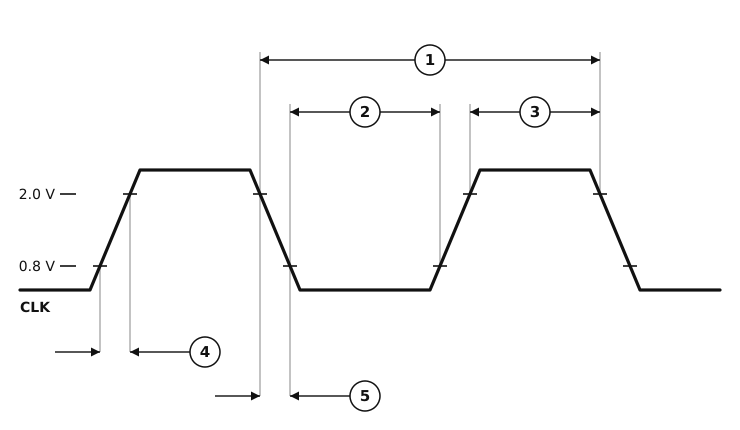

# Figure 2 — Clock Input Timing Diagram

MC68030 clock input, redrawn from **Figure 2** of `MC68030EC/D` Rev. 1 (PDF page 12, printed page 10 — see [`06-timing-diagrams.pdf`](06-timing-diagrams.pdf) page 1 for the original scan).



## What each measurement is

The waveform is drawn with deliberately exaggerated ramps so the edge measurements are visible; the two horizontal references are the **2.0 V** (V<sub>IH</sub> minimum) and **0.8 V** (V<sub>IL</sub> maximum) thresholds from the [DC specifications](dc-electrical-specifications.csv).

| | Measurement | Taken between |
|:-:|---|---|
| ① | Cycle time | the 2.0 V point of one falling edge and the 2.0 V point of the next falling edge — one full period |
| ② | Clock pulse width, low | the 0.8 V point of a falling edge and the 0.8 V point of the following rising edge |
| ③ | Clock pulse width, high | the 2.0 V point of a rising edge and the 2.0 V point of the following falling edge |
| ④ | Rise time | the 0.8 V and 2.0 V points of a rising edge |
| ⑤ | Fall time | the 2.0 V and 0.8 V points of a falling edge |

## AC electrical specifications — clock input

V<sub>CC</sub> = 5.0 Vdc ± 5 %, GND = 0 Vdc; 40 MHz T<sub>A</sub> = 0 to 70 °C, 50 MHz T<sub>A</sub> = 0 °C to T<sub>C</sub> = 80 °C. The 50 MHz grade additionally requires T<sub>case</sub> ≤ 80 °C.

<!-- BEGIN TABLE from=ac-electrical-specifications.csv table=clock -->
| On figure | Num. | Characteristic | Unit | 20 MHz | 25 MHz | 33.33 MHz | 40 MHz | 50 MHz |
|:-:|:-:|---|:-:|--:|--:|--:|--:|--:|
| — | — | Frequency of Operation | MHz | 12.5–20 | 12.5–25 | 20–33.33 | 25–40 | 25–50 |
| ① | 1 | Cycle Time Clock | ns | 50–80 | 40–80 | 30–50 | 25–40 | 20–40 |
| ② ③ | 2, 3 | Clock Pulse Width Measured from 1.5 V to 1.5 V | ns | 23–57 | 19–61 | 14–36 | 11.5–29 | 9.5–30.5 |
| ④ ⑤ | 4, 5 | Clock Rise and Fall Times | ns | ≤ 5 | ≤ 4 | ≤ 3 | ≤ 2 | ≤ 2 |
<!-- END TABLE -->

`≤` marks a maximum with no minimum specified. Specifications ② and ③ share one table entry, as do ④ and ⑤.

Sanity check on the numbers: at every grade except 40 MHz, minimum pulse width + maximum pulse width equals the maximum cycle time exactly (23 + 57 = 80, 19 + 61 = 80, 14 + 36 = 50, 9.5 + 30.5 = 40). The 40 MHz grade gives 11.5 + 29 = 40.5 against a 40 ns maximum cycle — a half-nanosecond of rounding slack in the source, not a transcription error.

## Notes on the redrawing

- **The figure and the table disagree about where pulse width is measured.** The table says specifications 2 and 3 are *"Clock Pulse Width Measured from 1.5 V to 1.5 V"*, but Figure 2 draws no 1.5 V reference at all — its ② and ③ dimension lines terminate on the 0.8 V and 2.0 V crossings, which are the only levels the figure labels. The redrawing follows the figure, since that is what it is a redrawing *of*; **use the table's 1.5 V when you are designing to the numbers**, because the table is where the numbers live.
- The diagram is schematic, as the original is. Ramp width, plateau width and the ratio between them are not to scale and carry no information — only the *relationships* between the marked points do.
- A `CLK` signal label has been added at the left; the original figure has none, relying on its caption.
- The original's construction lines are reproduced, including the ones that run across the waveform.

## Format

This is a hand-authored **SVG**, referenced from the markdown as an ordinary image, so it renders anywhere markdown does — including GitHub, which strips inline `<svg>` — and it adapts to light and dark themes via `prefers-color-scheme`.

Mermaid was not an option: it has no timing or waveform diagram type. WaveDrom, the usual choice for digital timing in markdown, was rejected for this particular figure because it draws idealised square waves with instantaneous edges — which would discard exactly what Figure 2 exists to show, namely the finite rise and fall ramps ④ and ⑤ and the threshold crossings the other measurements are referenced to. It remains a reasonable choice for the bus-cycle figures 3–7, where edges are incidental and the content is signal *sequencing*.

## Regenerating the table

The specification table above is generated from [`ac-electrical-specifications.csv`](ac-electrical-specifications.csv) and delimited by `BEGIN TABLE` / `END TABLE` comments — do not edit it by hand. After changing the CSV:

```sh
python3 make-figure-tables.py            # updates every figure-*.md
python3 make-figure-tables.py figure-02-clock-input-timing.md   # or just one
```
