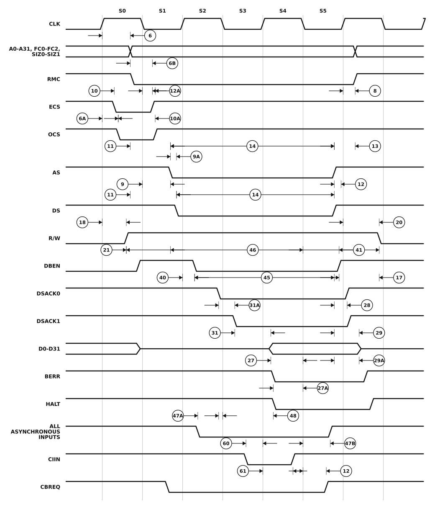

# Figure 3 — Asynchronous Read Cycle Timing Diagram

Redrawn from **Figure 3** of `MC68030EC/D` Rev. 1 (PDF page 13, printed page 11 —
see [`06-timing-diagrams.pdf`](06-timing-diagrams.pdf) page 2 for the original scan).

A complete asynchronous read, states **S0** through **S5** — three clock periods, since each bus state is one half cycle. The address, function codes and size are driven in S0 alongside `ECS`/`OCS`; `AS` and `DS` assert in S1; `DBEN` follows in S2; the slave returns `DSACK0`/`DSACK1` and data is latched at the end of S4; everything negates in S5.



## Specifications marked on this figure

<!-- BEGIN TABLE from=ac-electrical-specifications.csv table=read-write nums=6|6A|6B|8|9|9A|10|10A|11|12|12A|13|14|17|18|20|21|27|27A|28|29|29A|31|31A|40|41|45|46|47A|47B|48|60|61 -->
| On figure | Num. | Characteristic | Unit | 20 MHz | 25 MHz | 33.33 MHz | 40 MHz | 50 MHz |
|:-:|:-:|---|:-:|--:|--:|--:|--:|--:|
| ⑥ | 6 | Clock High to Function Code, Size, RMC, IPEND, CIOUT, Address Valid | ns | 0–25 | 0–20 | 0–14 | 0–14 | 0–14 |
| — | 6A | Clock High to ECS, OCS Asserted | ns | 0–15 | 0–15 | 0–12 | 0–10 | 0–10 |
| — | 6B | Function Code, Size, RMC, IPEND, CIOUT, Address Valid to Negating Edge of ECS | ns | ≥ 4 | ≥ 3 | ≥ 3 | ≥ 3 | ≥ 3 |
| ⑧ | 8 | Clock High to Function Code, Size, RMC, IPEND, CIOUT, Address Invalid | ns | ≥ 0 | ≥ 0 | ≥ 0 | ≥ 0 | ≥ 0 |
| ⑨ | 9 | Clock Low to AS, DS Asserted, CBREQ Valid | ns | 3–20 | 3–18 | 2–10 | 2–10 | 2–10 |
| — | 9A | AS to DS Assertion Skew (Read) | ns | -10–10 | -10–10 | -8–8 | -6–6 | -6–6 |
| — | 10 | ECS Width Asserted | ns | ≥ 15 | ≥ 10 | ≥ 8 | ≥ 5 | ≥ 4 |
| — | 10A | OCS Width Asserted | ns | ≥ 15 | ≥ 10 | ≥ 8 | ≥ 5 | ≥ 4 |
| — | 11 | Function Code, Size, RMC, CIOUT, Address Valid to Asserting Edge of AS Asserted (and DS Asserted, Read) | ns | ≥ 10 | ≥ 7 | ≥ 5 | ≥ 5 | ≥ 3 |
| — | 12 | Clock Low to AS, DS, CBREQ Negated | ns | 0–20 | 0–18 | 0–10 | 0–10 | 0–10 |
| — | 12A | Clock Low to ECS/OCS Negated | ns | 0–20 | 0–18 | 0–15 | 0–12 | 0–11 |
| — | 13 | AS, DS Negated to Function Code, Size, RMC, CIOUT, Address Invalid | ns | ≥ 10 | ≥ 7 | ≥ 5 | ≥ 3 | ≥ 3 |
| — | 14 | AS (and DS Read) Width Asserted (Asynchronous Cycle) | ns | ≥ 85 | ≥ 70 | ≥ 45 | ≥ 30 | ≥ 25 |
| — | 17 | AS, DS Negated to R/W Invalid | ns | ≥ 10 | ≥ 7 | ≥ 5 | ≥ 3 | ≥ 3 |
| — | 18 | Clock High to R/W High | ns | 0–25 | 0–20 | 0–15 | 0–14 | 0–14 |
| — | 20 | Clock High to R/W Low | ns | 0–25 | 0–20 | 0–15 | 0–14 | 0–14 |
| — | 21 | R/W High to AS Asserted | ns | ≥ 10 | ≥ 7 | ≥ 5 | ≥ 5 | ≥ 3 |
| — | 27 | Data-In Valid to Clock Low (Setup) | ns | ≥ 4 | ≥ 2 | ≥ 1 | ≥ 1 | ≥ 1 |
| — | 27A | Late BERR/HALT Asserted to Clock Low (Setup) | ns | ≥ 10 | ≥ 5 | ≥ 3 | ≥ 3 | ≥ 3 |
| — | 28 | AS, DS Negated to DSACKx, BERR, HALT, AVEC Negated (Asynchronous Hold) | ns | 0–50 | 0–40 | 0–30 | 0–20 | 0–15 |
| — | 29 | AS, DS Negated to Data-In Invalid (Asynchronous Hold) | ns | ≥ 0 | ≥ 0 | ≥ 0 | ≥ 0 | ≥ 0 |
| — | 29A | AS, DS Negated to Data-In High Impedance | ns | ≤ 50 | ≤ 40 | ≤ 30 | ≤ 25 | ≤ 20 |
| — | 31 | DSACKx Asserted to Data-In Valid (Asynchronous Data Setup) | ns | ≤ 43 | ≤ 28 | ≤ 20 | ≤ 14 | ≤ 13 |
| — | 31A | DSACKx Asserted to DSACKx Valid (Skew) | ns | ≤ 10 | ≤ 7 | ≤ 5 | ≤ 3 | ≤ 3 |
| — | 40 | Clock High to DBEN Asserted (Read) | ns | 0–25 | 0–20 | 0–18 | 0–16 | 0–14 |
| — | 41 | Clock Low to DBEN Negated (Read) | ns | 0–25 | 0–20 | 0–18 | 0–16 | 0–14 |
| — | 45 | DBEN Width Asserted | ns | ≥ 100 | ≥ 80 | ≥ 60 | ≥ 45 | ≥ 40 |
| — | 46 | R/W Width Asserted (Asynchronous Write or Read) | ns | ≥ 125 | ≥ 100 | ≥ 75 | ≥ 50 | ≥ 40 |
| — | 47A | Asynchronous Input Setup Time to Clock Low | ns | ≥ 4 | ≥ 2 | ≥ 2 | ≥ 2 | ≥ 2 |
| — | 47B | Asynchronous Input Hold Time from Clock Low | ns | ≥ 12 | ≥ 8 | ≥ 6 | ≥ 6 | ≥ 6 |
| — | 48 | DSACKx Asserted to BERR, HALT Asserted | ns | ≤ 20 | ≤ 25 | ≤ 18 | ≤ 14 | ≤ 13 |
| — | 60 | Synchronous Input Valid to Clock High (Setup Time) | ns | ≥ 4 | ≥ 2 | ≥ 2 | ≥ 2 | ≥ 2 |
| — | 61 | Clock High to Synchronous Input Invalid (Hold Time) | ns | ≥ 12 | ≥ 8 | ≥ 6 | ≥ 6 | ≥ 6 |
<!-- END TABLE -->

A range `a–b` is min–max; `≤ b` is a maximum with no minimum specified; `≥ a` is a
minimum with no maximum. Full descriptions, footnotes and the other speed-grade
columns are in [`ac-electrical-specifications.csv`](ac-electrical-specifications.csv).

## About this redrawing

The waveforms were transcribed from the 300 dpi scan of the source page: the state
boundaries printed in the figure were located mechanically, and each signal's
transitions measured against that grid. Callout anchors follow what the
corresponding specification actually measures, per its description in
[`ac-electrical-specifications.csv`](ac-electrical-specifications.csv).

**Horizontal placement is schematic — and so is the original's.** The source figure
carries no time axis, its edge ramps are grossly exaggerated, and nothing in it is
to scale. Read the *ordering* and the *anchor points* from the picture; read the
*numbers* from the table. Overbars are lost in the redrawing: `AS`, `DS`, `ECS`,
`DSACKx` and the rest are active low.

Rendered as a plain SVG referenced as an image, which is the only diagram format
that survives GitHub's markdown pipeline — GitHub supports no waveform syntax
(Mermaid has none) and strips inline `<svg>`. The figure adapts to light and dark
themes.

## Regenerating

```sh
python3 make-figure-svg.py 3      # redraw this figure
python3 make-figure-tables.py         # refresh the table below from the CSV
```
