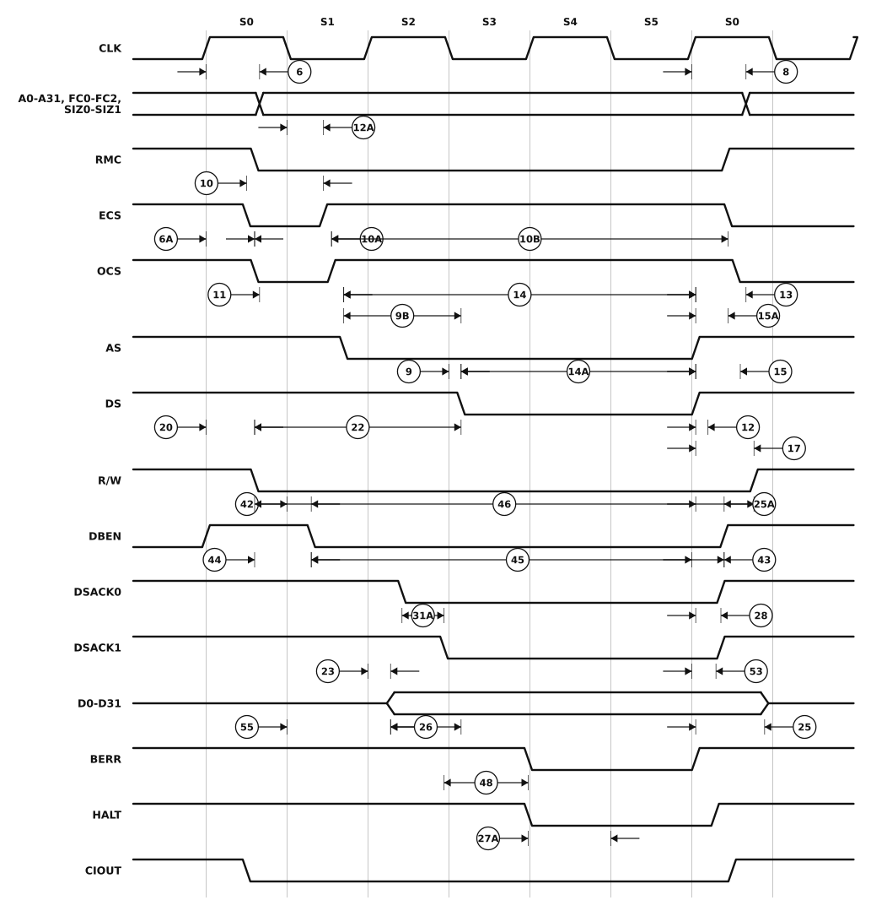

# Figure 4 — Asynchronous Write Cycle Timing Diagram

Redrawn from **Figure 4** of `MC68030EC/D` Rev. 1 (PDF page 14, printed page 12 —
see [`06-timing-diagrams.pdf`](06-timing-diagrams.pdf) page 2 for the original scan).

The write counterpart of Figure 3. The visible differences: `R/W` is driven **low** through the cycle, `DS` asserts a full state later than `AS` (specification 9B measures that gap, and has no read-cycle equivalent), and the processor drives `D0-D31` from S2 rather than sampling it. `CIOUT` replaces the read figure's input signals.



## Specifications marked on this figure

<!-- BEGIN TABLE from=ac-electrical-specifications.csv table=read-write nums=6|6A|8|9|9B|10|10A|10B|11|12|12A|13|14|14A|15|15A|17|20|22|23|25|25A|26|27A|28|31A|42|43|44|45|46|48|53|55 -->
| On figure | Num. | Characteristic | Unit | 20 MHz | 25 MHz | 33.33 MHz | 40 MHz | 50 MHz |
|:-:|:-:|---|:-:|--:|--:|--:|--:|--:|
| ⑥ | 6 | Clock High to Function Code, Size, RMC, IPEND, CIOUT, Address Valid | ns | 0–25 | 0–20 | 0–14 | 0–14 | 0–14 |
| — | 6A | Clock High to ECS, OCS Asserted | ns | 0–15 | 0–15 | 0–12 | 0–10 | 0–10 |
| ⑧ | 8 | Clock High to Function Code, Size, RMC, IPEND, CIOUT, Address Invalid | ns | ≥ 0 | ≥ 0 | ≥ 0 | ≥ 0 | ≥ 0 |
| ⑨ | 9 | Clock Low to AS, DS Asserted, CBREQ Valid | ns | 3–20 | 3–18 | 2–10 | 2–10 | 2–10 |
| — | 9B | AS Asserted to DS Asserted (Write) | ns | ≥ 32 | ≥ 27 | ≥ 22 | ≥ 16 | ≥ 14 |
| — | 10 | ECS Width Asserted | ns | ≥ 15 | ≥ 10 | ≥ 8 | ≥ 5 | ≥ 4 |
| — | 10A | OCS Width Asserted | ns | ≥ 15 | ≥ 10 | ≥ 8 | ≥ 5 | ≥ 4 |
| — | 10B | ECS, OCS Width Negated | ns | ≥ 10 | ≥ 5 | ≥ 5 | ≥ 5 | ≥ 4 |
| — | 11 | Function Code, Size, RMC, CIOUT, Address Valid to Asserting Edge of AS Asserted (and DS Asserted, Read) | ns | ≥ 10 | ≥ 7 | ≥ 5 | ≥ 5 | ≥ 3 |
| — | 12 | Clock Low to AS, DS, CBREQ Negated | ns | 0–20 | 0–18 | 0–10 | 0–10 | 0–10 |
| — | 12A | Clock Low to ECS/OCS Negated | ns | 0–20 | 0–18 | 0–15 | 0–12 | 0–11 |
| — | 13 | AS, DS Negated to Function Code, Size, RMC, CIOUT, Address Invalid | ns | ≥ 10 | ≥ 7 | ≥ 5 | ≥ 3 | ≥ 3 |
| — | 14 | AS (and DS Read) Width Asserted (Asynchronous Cycle) | ns | ≥ 85 | ≥ 70 | ≥ 45 | ≥ 30 | ≥ 25 |
| — | 14A | DS Width Asserted (Write) | ns | ≥ 38 | ≥ 30 | ≥ 23 | ≥ 18 | ≥ 13 |
| — | 15 | AS, DS Width Negated | ns | ≥ 38 | ≥ 30 | ≥ 23 | ≥ 18 | ≥ 13 |
| — | 15A | DS Negated to AS Asserted | ns | ≥ 30 | ≥ 25 | ≥ 18 | ≥ 16 | ≥ 14 |
| — | 17 | AS, DS Negated to R/W Invalid | ns | ≥ 10 | ≥ 7 | ≥ 5 | ≥ 3 | ≥ 3 |
| — | 20 | Clock High to R/W Low | ns | 0–25 | 0–20 | 0–15 | 0–14 | 0–14 |
| — | 22 | R/W Low to DS Asserted (Write) | ns | ≥ 60 | ≥ 47 | ≥ 35 | ≥ 24 | ≥ 23 |
| — | 23 | Clock High to Data-Out Valid | ns | ≤ 25 | ≤ 20 | ≤ 14 | ≤ 14 | ≤ 14 |
| — | 25 | AS, DS Negated to Data-Out Invalid | ns | ≥ 10 | ≥ 7 | ≥ 5 | ≥ 3 | ≥ 3 |
| — | 25A | DS Negated to DBEN Negated (Write) | ns | ≥ 10 | ≥ 7 | ≥ 5 | ≥ 3 | ≥ 3 |
| — | 26 | Data-Out Valid to Asserting Edge of DS Asserted (Write) | ns | ≥ 10 | ≥ 7 | ≥ 5 | ≥ 3 | ≥ 3 |
| — | 27A | Late BERR/HALT Asserted to Clock Low (Setup) | ns | ≥ 10 | ≥ 5 | ≥ 3 | ≥ 3 | ≥ 3 |
| — | 28 | AS, DS Negated to DSACKx, BERR, HALT, AVEC Negated (Asynchronous Hold) | ns | 0–50 | 0–40 | 0–30 | 0–20 | 0–15 |
| — | 31A | DSACKx Asserted to DSACKx Valid (Skew) | ns | ≤ 10 | ≤ 7 | ≤ 5 | ≤ 3 | ≤ 3 |
| — | 42 | Clock Low to DBEN Asserted (Write) | ns | 0–25 | 0–20 | 0–18 | 0–16 | 0–14 |
| — | 43 | Clock High to DBEN Negated (Write) | ns | 0–25 | 0–20 | 0–18 | 0–16 | 0–14 |
| — | 44 | R/W Low to DBEN Asserted (Write) | ns | ≥ 10 | ≥ 7 | ≥ 5 | ≥ 5 | ≥ 5 |
| — | 45 | DBEN Width Asserted | ns | ≥ 100 | ≥ 80 | ≥ 60 | ≥ 45 | ≥ 40 |
| — | 46 | R/W Width Asserted (Asynchronous Write or Read) | ns | ≥ 125 | ≥ 100 | ≥ 75 | ≥ 50 | ≥ 40 |
| — | 48 | DSACKx Asserted to BERR, HALT Asserted | ns | ≤ 20 | ≤ 25 | ≤ 18 | ≤ 14 | ≤ 13 |
| — | 53 | Data-Out Hold from Clock High | ns | ≥ 3 | ≥ 3 | ≥ 2 | ≥ 2 | ≥ 2 |
| — | 55 | R/W Asserted to Data Bus Impedance Change | ns | ≥ 25 | ≥ 20 | ≥ 15 | ≥ 11 | ≥ 11 |
<!-- END TABLE -->

A range `a–b` is min–max; `≤ b` is a maximum with no minimum specified; `≥ a` is a
minimum with no maximum. Full descriptions, footnotes and the other speed-grade
columns are in [`ac-electrical-specifications.csv`](ac-electrical-specifications.csv).

## About this redrawing

The waveforms were transcribed from the 300 dpi scan of the source page: the state
boundaries printed in the figure were located mechanically, and each signal's
transitions measured against that grid. Callout anchors follow what the
corresponding specification actually measures, per its description in
[`ac-electrical-specifications.csv`](ac-electrical-specifications.csv).

**Horizontal placement is schematic — and so is the original's.** The source figure
carries no time axis, its edge ramps are grossly exaggerated, and nothing in it is
to scale. Read the *ordering* and the *anchor points* from the picture; read the
*numbers* from the table. Overbars are lost in the redrawing: `AS`, `DS`, `ECS`,
`DSACKx` and the rest are active low.

Rendered as a plain SVG referenced as an image, which is the only diagram format
that survives GitHub's markdown pipeline — GitHub supports no waveform syntax
(Mermaid has none) and strips inline `<svg>`. The figure adapts to light and dark
themes.

## Regenerating

```sh
python3 make-figure-svg.py 4      # redraw this figure
python3 make-figure-tables.py         # refresh the table below from the CSV
```
