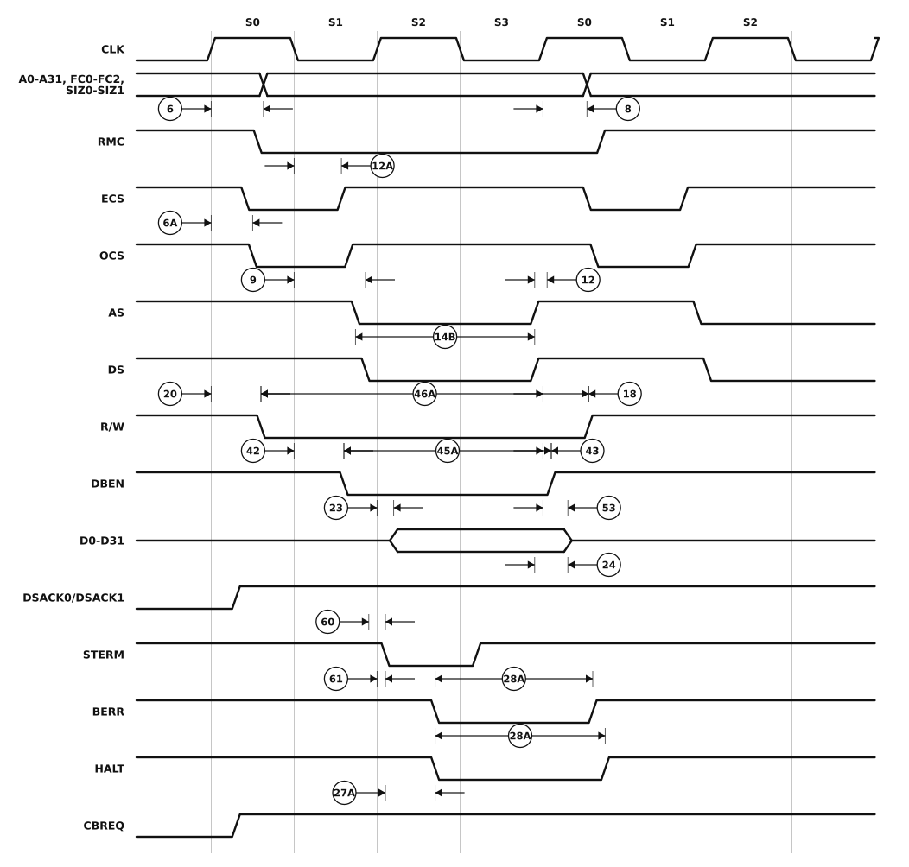

# Figure 6 — Synchronous Write Cycle Timing Diagram

Redrawn from **Figure 6** of `MC68030EC/D` Rev. 1 (PDF page 16, printed page 14 —
see [`06-timing-diagrams.pdf`](06-timing-diagrams.pdf) page 2 for the original scan).

The write counterpart of Figure 5, again two clock periods terminated by `STERM`. `BERR` and `HALT` appear here where the read figure shows the cache handshake, and specification 28A — the synchronous hold time — is marked on both of them.



## Specifications marked on this figure

<!-- BEGIN TABLE from=ac-electrical-specifications.csv table=read-write nums=6|6A|8|9|12|12A|14B|18|20|23|24|27A|28A|42|43|45A|46A|53|60|61 -->
| On figure | Num. | Characteristic | Unit | 20 MHz | 25 MHz | 33.33 MHz | 40 MHz | 50 MHz |
|:-:|:-:|---|:-:|--:|--:|--:|--:|--:|
| ⑥ | 6 | Clock High to Function Code, Size, RMC, IPEND, CIOUT, Address Valid | ns | 0–25 | 0–20 | 0–14 | 0–14 | 0–14 |
| — | 6A | Clock High to ECS, OCS Asserted | ns | 0–15 | 0–15 | 0–12 | 0–10 | 0–10 |
| ⑧ | 8 | Clock High to Function Code, Size, RMC, IPEND, CIOUT, Address Invalid | ns | ≥ 0 | ≥ 0 | ≥ 0 | ≥ 0 | ≥ 0 |
| ⑨ | 9 | Clock Low to AS, DS Asserted, CBREQ Valid | ns | 3–20 | 3–18 | 2–10 | 2–10 | 2–10 |
| — | 12 | Clock Low to AS, DS, CBREQ Negated | ns | 0–20 | 0–18 | 0–10 | 0–10 | 0–10 |
| — | 12A | Clock Low to ECS/OCS Negated | ns | 0–20 | 0–18 | 0–15 | 0–12 | 0–11 |
| — | 14B | AS (and DS, Read) Width Asserted (Synchronous Cycle) | ns | ≥ 35 | ≥ 30 | ≥ 23 | ≥ 18 | ≥ 13 |
| — | 18 | Clock High to R/W High | ns | 0–25 | 0–20 | 0–15 | 0–14 | 0–14 |
| — | 20 | Clock High to R/W Low | ns | 0–25 | 0–20 | 0–15 | 0–14 | 0–14 |
| — | 23 | Clock High to Data-Out Valid | ns | ≤ 25 | ≤ 20 | ≤ 14 | ≤ 14 | ≤ 14 |
| — | 24 | Data-Out Valid to Negating Edge of AS | ns | ≥ 8 | ≥ 5 | ≥ 3 | ≥ 3 | ≥ 3 |
| — | 27A | Late BERR/HALT Asserted to Clock Low (Setup) | ns | ≥ 10 | ≥ 5 | ≥ 3 | ≥ 3 | ≥ 3 |
| — | 28A | Clock Low to DSACKx, BERR, HALT, AVEC Negated (Synchronous Hold) | ns | 12–85 | 8–70 | 6–50 | 6–40 | 6–35 |
| — | 42 | Clock Low to DBEN Asserted (Write) | ns | 0–25 | 0–20 | 0–18 | 0–16 | 0–14 |
| — | 43 | Clock High to DBEN Negated (Write) | ns | 0–25 | 0–20 | 0–18 | 0–16 | 0–14 |
| — | 45A | DBEN Width Asserted | ns | ≥ 50 | ≥ 40 | ≥ 30 | ≥ 22 | ≥ 20 |
| — | 46A | R/W Width Asserted (Synchronous Write or Read) | ns | ≥ 75 | ≥ 60 | ≥ 45 | ≥ 30 | ≥ 25 |
| — | 53 | Data-Out Hold from Clock High | ns | ≥ 3 | ≥ 3 | ≥ 2 | ≥ 2 | ≥ 2 |
| — | 60 | Synchronous Input Valid to Clock High (Setup Time) | ns | ≥ 4 | ≥ 2 | ≥ 2 | ≥ 2 | ≥ 2 |
| — | 61 | Clock High to Synchronous Input Invalid (Hold Time) | ns | ≥ 12 | ≥ 8 | ≥ 6 | ≥ 6 | ≥ 6 |
<!-- END TABLE -->

A range `a–b` is min–max; `≤ b` is a maximum with no minimum specified; `≥ a` is a
minimum with no maximum. Full descriptions, footnotes and the other speed-grade
columns are in [`ac-electrical-specifications.csv`](ac-electrical-specifications.csv).

## About this redrawing

The waveforms were transcribed from the 300 dpi scan of the source page: the state
boundaries printed in the figure were located mechanically, and each signal's
transitions measured against that grid. Callout anchors follow what the
corresponding specification actually measures, per its description in
[`ac-electrical-specifications.csv`](ac-electrical-specifications.csv).

**Horizontal placement is schematic — and so is the original's.** The source figure
carries no time axis, its edge ramps are grossly exaggerated, and nothing in it is
to scale. Read the *ordering* and the *anchor points* from the picture; read the
*numbers* from the table. Overbars are lost in the redrawing: `AS`, `DS`, `ECS`,
`DSACKx` and the rest are active low.

Rendered as a plain SVG referenced as an image, which is the only diagram format
that survives GitHub's markdown pipeline — GitHub supports no waveform syntax
(Mermaid has none) and strips inline `<svg>`. The figure adapts to light and dark
themes.

## Regenerating

```sh
python3 make-figure-svg.py 6      # redraw this figure
python3 make-figure-tables.py         # refresh the table below from the CSV
```
