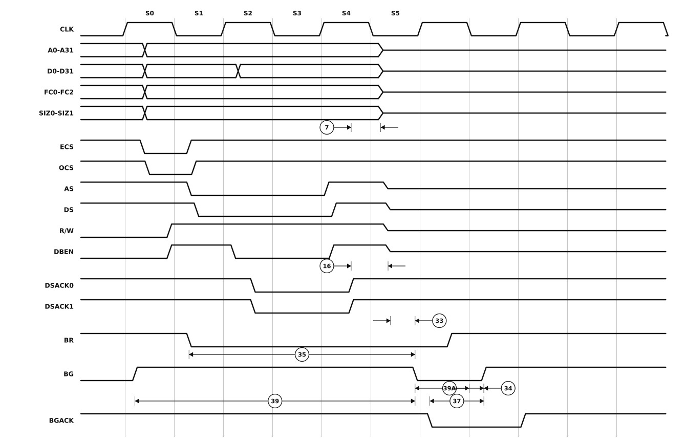

# Figure 7 — Bus Arbitration Timing Diagram

Redrawn from **Figure 7** of `MC68030EC/D` Rev. 1 (PDF page 17, printed page 15 —
see [`06-timing-diagrams.pdf`](06-timing-diagrams.pdf) page 2 for the original scan).

An alternate bus master taking the bus. `BR` is asserted during the cycle, the processor answers with `BG`, and once the current cycle finishes it releases the bus: the address, data, function code, size and the control strobes all go to **high impedance**, drawn here as a mid-rail line. `BGACK` then asserts and `BG` is negated.



## Specifications marked on this figure

<!-- BEGIN TABLE from=ac-electrical-specifications.csv table=read-write nums=7|16|33|34|35|37|39|39A -->
| On figure | Num. | Characteristic | Unit | 20 MHz | 25 MHz | 33.33 MHz | 40 MHz | 50 MHz |
|:-:|:-:|---|:-:|--:|--:|--:|--:|--:|
| ⑦ | 7 | Clock High to Function Code, Size, RMC, CIOUT, Address, Data High Impedance | ns | 0–50 | 0–40 | 0–30 | 0–25 | 0–20 |
| — | 16 | Clock High to AS, DS, R/W, DBEN, CBREQ High Impedance | ns | ≤ 50 | ≤ 40 | ≤ 30 | ≤ 25 | ≤ 20 |
| — | 33 | Clock Low to BG Asserted | ns | 0–25 | 0–20 | 0–15 | 0–14 | 0–14 |
| — | 34 | Clock Low to BG Negated | ns | 0–25 | 0–20 | 0–15 | 0–14 | 0–14 |
| — | 35 | BR Asserted to BG Asserted (RMC Not Asserted) | Clks | 1.5–3.5 | 1.5–3.5 | 1.5–3.5 | 1.5–3.5 | 1.5–3.5 |
| — | 37 | BGACK Asserted to BG Negated | Clks | 1.5–3.5 | 1.5–3.5 | 1.5–3.5 | 1.5–3.5 | 1.5–3.5 |
| — | 39 | BG Width Negated | ns | ≥ 75 | ≥ 60 | ≥ 45 | ≥ 30 | ≥ 30 |
| — | 39A | BG Width Asserted | ns | ≥ 75 | ≥ 60 | ≥ 45 | ≥ 30 | ≥ 30 |
<!-- END TABLE -->

A range `a–b` is min–max; `≤ b` is a maximum with no minimum specified; `≥ a` is a
minimum with no maximum. Full descriptions, footnotes and the other speed-grade
columns are in [`ac-electrical-specifications.csv`](ac-electrical-specifications.csv).

## About this redrawing

The waveforms were transcribed from the 300 dpi scan of the source page: the state
boundaries printed in the figure were located mechanically, and each signal's
transitions measured against that grid. Callout anchors follow what the
corresponding specification actually measures, per its description in
[`ac-electrical-specifications.csv`](ac-electrical-specifications.csv).

**Horizontal placement is schematic — and so is the original's.** The source figure
carries no time axis, its edge ramps are grossly exaggerated, and nothing in it is
to scale. Read the *ordering* and the *anchor points* from the picture; read the
*numbers* from the table. Overbars are lost in the redrawing: `AS`, `DS`, `ECS`,
`DSACKx` and the rest are active low.

Rendered as a plain SVG referenced as an image, which is the only diagram format
that survives GitHub's markdown pipeline — GitHub supports no waveform syntax
(Mermaid has none) and strips inline `<svg>`. The figure adapts to light and dark
themes.

## Regenerating

```sh
python3 make-figure-svg.py 7      # redraw this figure
python3 make-figure-tables.py         # refresh the table below from the CSV
```
