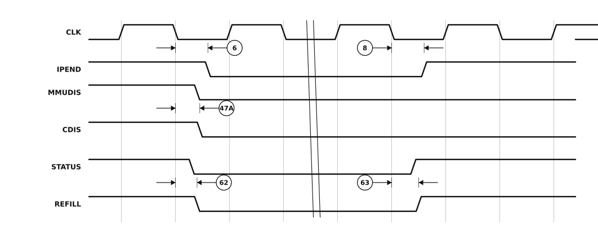

# Figure 8 — Other Signal Timings

Redrawn from **Figure 8** of `MC68030EC/D` Rev. 1 (PDF page 18, printed page 16 —
see [`06-timing-diagrams.pdf`](06-timing-diagrams.pdf) page 2 for the original scan).

The signals that do not belong to a bus cycle: the interrupt-pending output `IPEND`, the `MMUDIS` and `CDIS` disable inputs, and the `STATUS` and `REFILL` pipeline outputs. The original uses a drafting break to show that arbitrary time passes between assertion and negation; that break is reproduced here.



## Specifications marked on this figure

<!-- BEGIN TABLE from=ac-electrical-specifications.csv table=read-write nums=6|8|47A|62|63 -->
| On figure | Num. | Characteristic | Unit | 20 MHz | 25 MHz | 33.33 MHz | 40 MHz | 50 MHz |
|:-:|:-:|---|:-:|--:|--:|--:|--:|--:|
| ⑥ | 6 | Clock High to Function Code, Size, RMC, IPEND, CIOUT, Address Valid | ns | 0–25 | 0–20 | 0–14 | 0–14 | 0–14 |
| ⑧ | 8 | Clock High to Function Code, Size, RMC, IPEND, CIOUT, Address Invalid | ns | ≥ 0 | ≥ 0 | ≥ 0 | ≥ 0 | ≥ 0 |
| — | 47A | Asynchronous Input Setup Time to Clock Low | ns | ≥ 4 | ≥ 2 | ≥ 2 | ≥ 2 | ≥ 2 |
| — | 62 | Clock Low to STATUS, REFILL Asserted | ns | 0–25 | 0–20 | 0–15 | 0–15 | 0–15 |
| — | 63 | Clock Low to STATUS, REFILL Negated | ns | 0–25 | 0–20 | 0–15 | 0–15 | 0–15 |
<!-- END TABLE -->

A range `a–b` is min–max; `≤ b` is a maximum with no minimum specified; `≥ a` is a
minimum with no maximum. Full descriptions, footnotes and the other speed-grade
columns are in [`ac-electrical-specifications.csv`](ac-electrical-specifications.csv).

## About this redrawing

The waveforms were transcribed from the 300 dpi scan of the source page: the state
boundaries printed in the figure were located mechanically, and each signal's
transitions measured against that grid. Callout anchors follow what the
corresponding specification actually measures, per its description in
[`ac-electrical-specifications.csv`](ac-electrical-specifications.csv).

**Horizontal placement is schematic — and so is the original's.** The source figure
carries no time axis, its edge ramps are grossly exaggerated, and nothing in it is
to scale. Read the *ordering* and the *anchor points* from the picture; read the
*numbers* from the table. Overbars are lost in the redrawing: `AS`, `DS`, `ECS`,
`DSACKx` and the rest are active low.

Rendered as a plain SVG referenced as an image, which is the only diagram format
that survives GitHub's markdown pipeline — GitHub supports no waveform syntax
(Mermaid has none) and strips inline `<svg>`. The figure adapts to light and dark
themes.

## Regenerating

```sh
python3 make-figure-svg.py 8      # redraw this figure
python3 make-figure-tables.py         # refresh the table below from the CSV
```
