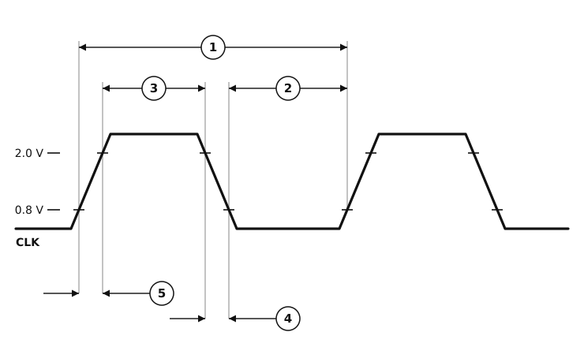

# Figure 12-1 — Clock Input Timing Diagram

MC68881/MC68882 clock input, redrawn from **Figure 12-1** of the MC68881/MC68882
User's Manual (PDF page 379, printed page 12-3 — see
[`16-section-12-electrical-specifications.pdf`](16-section-12-electrical-specifications.pdf)
page 3 for the original scan).



## What each measurement is

The waveform is drawn with deliberately exaggerated ramps so the edge measurements
are visible; the two horizontal references are the **2.0 V** (V<sub>IH</sub> minimum)
and **0.8 V** (V<sub>IL</sub> maximum) thresholds from the
[DC specifications](dc-electrical-specifications.csv).

| | Measurement | Taken between |
|:-:|---|---|
| ① | Cycle time | the 0.8 V point of one rising edge and the 0.8 V point of the next rising edge — one full period |
| ② | Clock pulse width, low | the 0.8 V point of a falling edge and the 0.8 V point of the following rising edge |
| ③ | Clock pulse width, high | the 2.0 V point of a rising edge and the 2.0 V point of the following falling edge |
| ④ | Fall time | the 2.0 V and 0.8 V points of a falling edge |
| ⑤ | Rise time | the 0.8 V and 2.0 V points of a rising edge |

Note that ④ is the **fall** time and ⑤ the **rise** time — the figure marks ⑤ on the
rising edge and ④ on the falling one. The table gives a single entry, "4, 5 Rise and
Fall Times", so the two share a limit and the assignment has no numerical consequence;
it is recorded here because it is the reverse of the equivalent MC68030 figure.

## AC electrical specifications — clock input

V<sub>CC</sub> = 5.0 Vdc ± 5 %, GND = 0 Vdc, T<sub>A</sub> = 0 °C to 70 °C.

<!-- BEGIN TABLE from=ac-electrical-specifications.csv table=clock -->
| Num. | Characteristic | Unit | 16.67 MHz | 20 MHz | 25 MHz | 33.33 MHz |
|:-:|---|:-:|--:|--:|--:|--:|
| — | Frequency of Operation | MHz | 8&nbsp;–&nbsp;16.67 | 12.5&nbsp;–&nbsp;20 | 12.5&nbsp;–&nbsp;25 | 16.7&nbsp;–&nbsp;33.33 |
| 1 | Cycle Time | ns | 60&nbsp;–&nbsp;125 | 50&nbsp;–&nbsp;80 | 40&nbsp;–&nbsp;80 | 30&nbsp;–&nbsp;60 |
| 2, 3 | Clock Pulse Width (Measured from 1.5 V to 1.5 V for 33 MHz) | ns | 24&nbsp;–&nbsp;95 | 20&nbsp;–&nbsp;54 | 15&nbsp;–&nbsp;59 | 14&nbsp;–&nbsp;66 |
| 4, 5 | Rise and Fall Times | ns | ≤ 5 | ≤ 5 | ≤ 4 | ≤ 3 |
<!-- END TABLE -->

`≤` marks a maximum with no minimum specified. Specifications ② and ③ share one table
entry, as do ④ and ⑤.

Sanity check on the numbers. A whole period must hold one high pulse and one low pulse,
so *minimum* pulse width + *maximum* pulse width can never exceed the *maximum* cycle
time. Three grades pass — 24 + 95 = 119 ≤ 125, 20 + 54 = 74 ≤ 80, 15 + 59 = 74 ≤ 80 —
but **the 33.33 MHz grade does not: 14 + 66 = 80 ns against a 60 ns maximum cycle.**
A 66 ns pulse simply does not fit inside a 60 ns period. Both the page image and the
PDF's text layer read 66, so this is the source's own arithmetic, not a transcription
error; it is the same kind of impossible corner the MC68030 data sheet has at its
specification 48. Design to the cycle time.

## Notes on the redrawing

- **The figure and the table disagree about where pulse width is measured.** The table
  says specifications 2 and 3 are *"Clock Pulse Width (Measured from 1.5 V to 1.5 V for
  33 MHz)"*, but Figure 12-1 draws no 1.5 V reference at all — its ② and ③ dimension
  lines terminate on the 0.8 V and 2.0 V crossings, the only levels the figure labels.
  The redrawing follows the figure, since that is what it is a redrawing *of*; **use the
  table's 1.5 V for the 33 MHz part when you are designing to the numbers**, because the
  table is where the numbers live.
- The diagram is schematic, as the original is. Ramp width, plateau width and the ratio
  between them are not to scale and carry no information — only the *relationships*
  between the marked points do.
- A `CLK` signal label has been added at the left; the original figure has none, relying
  on its caption.
- The original's construction lines are reproduced, including the ones that run across
  the waveform.

## Format

This is a hand-authored **SVG**, referenced from the markdown as an ordinary image, so
it renders anywhere markdown does — including GitHub, which strips inline `<svg>` — and
it adapts to light and dark themes via `prefers-color-scheme`.

Mermaid was not an option: it has no timing or waveform diagram type. WaveDrom, the
usual choice for digital timing in markdown, was rejected for this particular figure
because it draws idealised square waves with instantaneous edges — which would discard
exactly what Figure 12-1 exists to show, namely the finite rise and fall ramps ④ and ⑤
and the threshold crossings the other measurements are referenced to.

## Regenerating the table

The specification table above is generated from
[`ac-electrical-specifications.csv`](ac-electrical-specifications.csv) and delimited by
`BEGIN TABLE` / `END TABLE` comments — do not edit it by hand. After changing the CSV:

```sh
python3 make-figure-tables.py            # updates every figure-*.md
python3 make-figure-tables.py figure-12-1-clock-input-timing.md   # or just one
```
