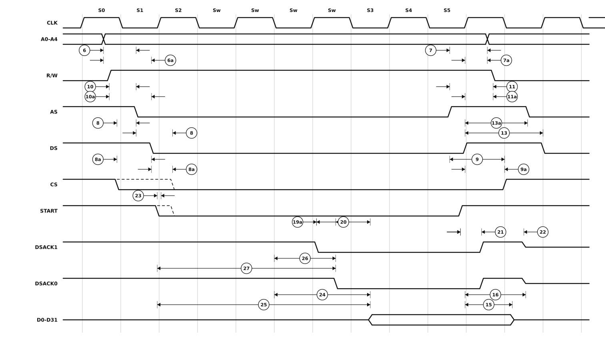

# Figure 12-4 — Synchronous Read Cycle Timing Diagram

Redrawn from **Figure 12-4** of the MC68881/MC68882 User's Manual (PDF page 405,
printed Foldout-3 — see [`21-timing-diagram-foldouts.pdf`](21-timing-diagram-foldouts.pdf)
for the original scan, which carries all three bus-cycle figures side by side on one sheet).

A synchronous read — which happens only when the save or response CIR is read (footnote 3). Here the FPCP times its response from `CLK` rather than from the strobes, so the figure adds the clock-referenced specifications 23, 24 and 26 and the two-term specifications 25 and 27. Four wait states are shown between S2 and S3; the beginning of the following cycle appears at the right.



## Specifications marked on this figure

<!-- BEGIN TABLE from=ac-electrical-specifications.csv table=read-write nums=6|6A|7|7A|8|8A|9|9A|10|10A|11|11A|13|13A|15|16|19A|20|21|22|23|24|25|26|27 -->
| Num. | Characteristic | Unit | 16.67 MHz | 20 MHz | 25 MHz | 33.33 MHz |
|:-:|---|:-:|--:|--:|--:|--:|
| 6 | Address Valid to AS Asserted | ns | ≥ 15 | ≥ 10 | ≥ 5 | ≥ 5 |
| 6A | Address Valid to DS Asserted (Read) | ns | ≥ 15 | ≥ 10 | ≥ 5 | ≥ 5 |
| 7 | AS Negated to Address Invalid | ns | ≥ 10 | ≥ 10 | ≥ 5 | ≥ 5 |
| 7A | DS Negated to Address Invalid | ns | ≥ 10 | ≥ 10 | ≥ 5 | ≥ 5 |
| 8 | CS Negated to AS Asserted | ns | ≥ 0 | ≥ 0 | ≥ 0 | ≥ 0 |
| 8A | CS Negated to DS Asserted (Read) | ns | ≥ 0 | ≥ 0 | ≥ 0 | ≥ 0 |
| 9 | AS Negated to CS Negated | ns | ≥ 10 | ≥ 10 | ≥ 5 | ≥ 5 |
| 9A | DS Negated to CS Negated | ns | ≥ 10 | ≥ 10 | ≥ 5 | ≥ 5 |
| 10 | R/W High to AS Asserted (Read) | ns | ≥ 15 | ≥ 10 | ≥ 5 | ≥ 5 |
| 10A | R/W High to DS Asserted (Read) | ns | ≥ 15 | ≥ 10 | ≥ 5 | ≥ 5 |
| 11 | AS Negated to R/W Low (Read) or AS Negated to R/W High (Write) | ns | ≥ 10 | ≥ 10 | ≥ 5 | ≥ 5 |
| 11A | DS Negated to R/W Low (Read) or DS Negated to R/W High (Write) | ns | ≥ 10 | ≥ 10 | ≥ 5 | ≥ 5 |
| 13 | DS Width Negated | ns | ≥ 40 | ≥ 38 | ≥ 30 | ≥ 23 |
| 13A | DS Negated to AS Asserted | ns | ≥ 30 | ≥ 30 | ≥ 25 | ≥ 18 |
| 15 | DS Negated to Data-Out Invalid (Read) | ns | ≥ 0 | ≥ 0 | ≥ 0 | ≥ 0 |
| 16 | DS Negated to Data-Out High Impedance (Read) | ns | ≤ 50 | ≤ 30 | ≤ 30 | ≤ 20 |
| 19A | DSACK0 Asserted to DSACK1 Asserted (Skew) | ns | -15&nbsp;–&nbsp;15 | -10&nbsp;–&nbsp;10 | -10&nbsp;–&nbsp;10 | ≤ 5 |
| 20 | DSACK0 or DSACK1 Asserted to Data-Out Valid | ns | ≤ 50 | ≤ 43 | ≤ 32 | ≤ 17 |
| 21 | START False to DSACK0 and DSACK1 Negated | ns | ≤ 50 | ≤ 30 | ≤ 30 | ≤ 20 |
| 22 | START False to DSACK0 and DSACK1 High Impedance | ns | ≤ 70 | ≤ 40 | ≤ 40 | ≤ 30 |
| 23 | START True to Clock High (Synchronous Read) | ns | ≥ 0 | ≥ 0 | ≥ 0 | ≥ 0 |
| 24 | Clock Low to Data-Out Valid (Synchronous Read) | ns | ≤ 105 | ≤ 80 | ≤ 60 | ≤ 45 |
| 25 | START True to Data-Out Valid (Synchronous Read) | ns | 1.5 clk&nbsp;–&nbsp;105 + 2.5 clk | 1.5 clk&nbsp;–&nbsp;80 + 2.5 clk | 1.5 clk&nbsp;–&nbsp;60 + 2.5 clk | 1.5 clk&nbsp;–&nbsp;45 + 2.5 clk |
| 26 | Clock Low to DSACK0 and DSACK1 Asserted (Synchronous Read) | ns | ≤ 75 | ≤ 55 | ≤ 45 | ≤ 30 |
| 27 | START True to DSACK0 and DSACK1 Asserted (Synchronous Read) | ns | 1.5 clk&nbsp;–&nbsp;75 + 2.5 clk | 1.5 clk&nbsp;–&nbsp;55 + 2.5 clk | 1.5 clk&nbsp;–&nbsp;45 + 2.5 clk | 1.5 clk&nbsp;–&nbsp;30 + 2.5 clk |
<!-- END TABLE -->

The figures label these with a lowercase suffix — `6a` on the drawing is **6A** in the
table. A range `a – b` is min–max; `≤ b` is a maximum with no minimum specified; `≥ a`
is a minimum with no maximum; `+ n clk` is a clock-period term added to the nanosecond
figure. Full descriptions, footnotes and the source page of every row are in
[`ac-electrical-specifications.csv`](ac-electrical-specifications.csv).

## About this redrawing

Transcribed from a 300 dpi rendering of the foldout sheet. Callout anchors follow
what each specification actually measures, per its description in
[`ac-electrical-specifications.csv`](ac-electrical-specifications.csv).

**Where the figure and the table disagree about 11 and 11A, this redrawing follows
the table.** All three printed foldout figures put the label `11a` on the dimension
that starts at `AS` negating and `11` on the one that starts at `DS` negating — the
reverse of the specification table, which defines **11** as *AS Negated to R/W* and
**11A** as *DS Negated to R/W*. The two entries carry identical limits at every
speed grade, so nothing numerical turns on it.

**Horizontal placement is schematic — and so is the original's.** The source figure does carry a clock and the printed S0-S5 ruler, reproduced here; but its edge ramps are exaggerated and the spacing within a state is arbitrary. Read the
*ordering* and the *anchor points* from the picture; read the *numbers* from the
table. Overbars are lost in the redrawing: `AS`, `DS`, `CS`, `DSACKx` and `START`
are all active low.

The dashed edge on `CS` and `START` is the source's: `CS` may legitimately change
at either the solid or the dashed instant, which is why specifications 8 and 8A are
marked twice, once on each side of the strobe assertion. `START` is not a pin — it
is the logical condition `CS + AS + R/W·DS` (footnote 8), drawn as a signal for
clarity.

`DSACK0` and `DSACK1` are shown converging to a mid-rail line once released to high
impedance; the original draws the pull-up's decay instead.

Rendered as a plain SVG referenced as an image, which is the only diagram format
that survives GitHub's markdown pipeline — GitHub supports no waveform syntax
(Mermaid has none) and strips inline `<svg>`. The figure adapts to light and dark
themes.

## Regenerating

```sh
python3 make-figure-svg.py 4      # redraw this figure
python3 make-figure-tables.py         # refresh the table above from the CSV
```
